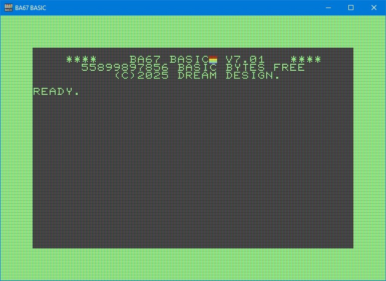

# BA67 - 80s BASIC Interpreter
Visit the project Homepage: [www.ba67.org](http://www.ba67.org).

## Contents
<!-- do not edit TOC_START and TOC_END lines. -->
<!-- See markdown_parser.h -->
<!-- TOC_START -->
  - [Contents](#contents)
  - [About](#about)
  - [Goal](#goal)
  - [Syntax](#syntax)
  - [Editor](#editor)
  - [Numbers](#numbers)
  - [Unicode](#unicode)
  - [Variables](#variables)
  - [Files](#files)
  - [Keywords, Commands, Functions](#keywords--commands--functions)
  - [Keywords](#keywords)
    - [DATA](#data)
    - [DEF FN](#def-fn)
    - [DELETE](#delete)
    - [DIM](#dim)
    - [ON](#on)
    - [FN](#fn)
    - [FOR](#for)
    - [GOSUB](#gosub)
    - [GOTO](#goto)
    - [IF](#if)
    - [LET](#let)
    - [KEY](#key)
    - [NEXT](#next)
    - [RCHARDEF](#rchardef)
    - [READ](#read)
    - [RESTORE](#restore)
    - [RETURN](#return)
    - [STEP](#step)
    - [THEN](#then)
    - [TO](#to)
  - [Commands](#commands)
    - [ABOUT](#about)
    - [AUTO](#auto)
    - [CLOSE](#close)
    - [CLR](#clr)
    - [COLOR](#color)
    - [CHDIR](#chdir)
    - [CATALOG](#catalog)
    - [CHAR](#char)
    - [CHARDEF](#chardef)
    - [END](#end)
    - [FAST](#fast)
    - [FIND](#find)
    - [GET](#get)
    - [HELP](#help)
    - [INPUT](#input)
    - [LIST](#list)
    - [LOAD](#load)
    - [MOVSPR](#movspr)
    - [NEW](#new)
    - [MODULE](#module)
    - [OPEN](#open)
    - [PLAY](#play)
      - [Technical Background](#technical-background)
    - [POKE](#poke)
    - [PRINT](#print)
    - [PRINT USING](#print-using)
    - [QUIT](#quit)
    - [QSAVE](#qsave)
    - [REM](#rem)
    - [RENUMBER](#renumber)
    - [RUN](#run)
    - [SAVE](#save)
    - [SCNCLR](#scnclr)
    - [SLOW](#slow)
    - [SOUND](#sound)
    - [SPRDEF](#sprdef)
    - [SPRITE](#sprite)
    - [STOP](#stop)
    - [SYS](#sys)
  - [Functions](#functions)
    - [ABS](#abs)
    - [ASC](#asc)
    - [ATN](#atn)
    - [CHR$](#chr-)
    - [COS](#cos)
    - [DEC](#dec)
    - [EXP](#exp)
    - [FRE](#fre)
    - [HEX$](#hex-)
    - [INSTR](#instr)
    - [INT](#int)
    - [JOY](#joy)
    - [LCASE$](#lcase-)
    - [LEFT$](#left-)
    - [LEN](#len)
    - [LOG](#log)
    - [MID$](#mid-)
    - [PEEK](#peek)
    - [POS](#pos)
    - [POSY](#posy)
    - [RIGHT$](#right-)
    - [RND](#rnd)
    - [SGN](#sgn)
    - [SIN](#sin)
    - [SPC](#spc)
    - [SQR](#sqr)
    - [STR$](#str-)
    - [TAB](#tab)
    - [TAN](#tan)
    - [UCASE$](#ucase-)
    - [VAL](#val)
    - [XOR](#xor)
  - [Reserved Commands](#reserved-commands)
- [ANNEX](#annex)
  - [A - Using the Source Code](#a---using-the-source-code)
    - [CHARDEF](#chardef)
  - [B - ABC Music Notation](#b---abc-music-notation)
    - [ABC Music Notation - Basics](#abc-music-notation---basics)
    - [Basic Structure](#basic-structure)
    - [Example:](#example-)
    - [Key Components:](#key-components-)
    - [Notes & Notation](#notes---notation)
    - [Chords & Decorations](#chords---decorations)
    - [Instruments](#instruments)
    - [Multi-Voice](#multi-voice)
    - [Editors](#editors)
    - [More Features](#more-features)
  - [C - Developers](#c---developers)
- [Disclaimer](#disclaimer)
<!-- TOC_END -->

## About
BA67 (pronounced BASIC SEVEN) is a standalone BASIC interpreter,
that can be used as a daily tool on a personal computer.

It is inspired by the Commodore BASIC V7 ©1977 from the C128.
Three times the digit 7 led to it's name BA67.



If you're familiar with the C64/C128, you will quickly find
yourself comfortable with this interpreter. But BASIC is also
a very easy to learn programming language as well as an
operating system. So it suits perfectly for beginners as
well.

Many have programmed BASIC interpreters before, so why
another? Well, they all had some sort of limitations,
or were written in some strange language that I don't like.

This BASIC is compatible with COMMODORE's BASIC V7,
but also features some improvements.

Here are the key features:
- Compatible with the famous Commodore's BASIC
- Variable names can be longer than 2 characters
- Unicode strings (no PETSCII or other exotic char sets)
- 64 bit precision for numbers
- 64 bit integers
- Direct access to your local file system
- Modular programming (See keyword `MODULE`)
- Written in C++ (using some C libraries)
- Very easy to use as a scripting language in your projects
- Easy to port to other platforms
- Liberal license


-------------------------------------------------------------
## Goal
Back in the 80s, everyone could start a computer and program
a simple
```
10 PRINT "HELLO WORLD"
20 GOTO 10
```

These days there are so many languages and programs to
install before the fun starts, that many do not even bother
to try it.

The goal of this project is to get people to start
programming.

It aims to provide a BASIC language, that sticks to a very
widespread standard, keep backwards compatibility and focus
on an easy to learn language with easy to understand syntax
and few keywords.

Keeping the backwards compatibility also enables you to have
AI generators answer your questions.

Complex operators, module definitions, structures and
inheritance are excluded on purpose. Yet, the language
should offer a modular approach for complex programs
without introducing complex syntax.

The very final goal would be to have a standalone hardware,
that boots to this BASIC.

It features a screen editor that should behave as the retro
one does.

Graphics and sound were added.

For the graphics an 40x25 character graphics with 16 colors
is set. Each character is monochrome or multicolor.
Characters can be easily generated with the `CHARDEF`
command and supports the full Unicode range
(uses a map internally).

For the sound, the ABC music notation is used. For sound
effects, DrPetter's SFXR is used. See `PLAY` and `SOUND`.

-------------------------------------------------------------
## Syntax
This interpreter tries to imitate and extend
COMMODORE's BASIC V7.

The parser is case sensitive, but the line input uppercases
everything outside of quotes for convenience.

Keywords must be separated with spaces, operators or braces.
The COMMODORE allowed `LETTER=1`, which was interpreted as
`LET TER=1` instead of `LET LETTER=1`. Also `PRINT LETTER`
was not possible, because the LET part was interpreted as a
command instead of the variable name.

In order to avoid confusions, this BASIC requires separating
commands from variables.

-------------------------------------------------------------
## Editor
The editor imitates the C64/C128 text editor. Use the ESC
key to abort a program execution or the listing of `CATALOG`
or `LIST`.

The F1 .. F12 keys are preprogrammed with some BASIC keywords
and can be configured using the KEY command.

Use Alt+INS key to toggle between insert mode and overwrite
mode. Use the INS key alone to insert a single character
space.

The Scroll Lock and the Shift keys can be used to pause
commands, that list large texts to the screen. Try the `LIST`
command or `CATALOG` on large directories.

When you press Ctrl+'.', the BA67 starts the emoji-panel
program if it can find it. Here you can pick an emoji or
Unicode character and insert it at the current cursor
position. You can find that program as well on
[github](https://github.com/KungPhoo/stdout-emoji-panel).


-------------------------------------------------------------
## Numbers
Number constants can be given in scientific notation
(-1.3e-5) or as floating point input (1.23). The decimal
separator is the period symbol, regardless of the computer's
locale settings.

Integers can be given up to 64 bits. A prefixed `$` is
interpreted as a hex number. `a = $7ffffff`.

-------------------------------------------------------------
## Unicode
This interpreter has full Unicode support. Even emoji 😀.
The Windows console, however, cannot display characters
above 0xffff and will display two characters instead ☹.

LEN, MID$ etc. work with Unicode code-points, so
LEN("äöü") = 3, even though the parser stores 6 utf8
bytes, internally.


-------------------------------------------------------------
## Variables
Variables can be double, integer or string variables and 
arrays of these.
Integers have a % postfix, where strings end with $.
The double variable 'a' and the integer variable 'a%' are
two separate variables. Also, arrays can have the same name
as non-array variables and are treated as separate variables.
(That's compatible with CBM BASIC)

There are built-in variables, that will be updated before
each statement is evaluated. These are:

| Variable  |  Value                           |
| --------- | -------------------------------- |
| TI        | current system time in 1/60 sec. |

## Files
The class that derives from `Os` should set the start
directory to a location, where BASIC programs are to
be stored.

When starting, the interpreter will load and run the
file "boot.bas" from the start directory and call `NEW`
to clear all variables.

You can edit and save this file for your needs and e.g.
adjust the `KEY` shortcuts etc.

The interpreter can load files without line numbers and will
numerate them automatically.

-------------------------------------------------------------
## Keywords, Commands, Functions
The following is a list of the BASIC hard-coded language
tokens you can use to write programs. They are split in 3
groups, where the first two can be considered as one - only
if you want to look at the source code, you will find these
two different groups.

Functions always take at least one argument in braces.

-------------------------------------------------------------
## Keywords
### DATA
**Usage:** `DATA value, value, string, "string with spaces", ...`

Provides data variables to be used with the READ keyword.

### DEF FN
**Usage** `DEF FN NAME(ARG[, ARG2, ...]) = ARG+ARG2...*`

Provides a way to define user functions, that can be called.
Internally, the function name always starts with FN, so this
is the only place, where `FN FOO` and `FNFOO` are valid and
equal.

### DELETE
**Usage:** `DELETE from [- to]`

Deletes the line numbers in the given range.


### DIM
**Usage:** `DIM var(size)`

Allocates an array with the specified size.

Example:
```basic
DIM A(10)
```

### ON
**Usage:** `ON expr GOTO/GOSUB line1, line2, ...`

Transfers execution to one of the specified lines based on
the value of `expr`.

Example:
```basic
ON X GOTO 100, 200, 300
```

### FN
See the `DEF FN` description, please.

### FOR
**Usage:** `FOR var = start TO end [STEP increment]`

Begins a loop with an optional increment.

Example:
```basic
FOR I = 1 TO 10 STEP 2
```

### GOSUB
**Usage:** `GOSUB line`

Calls a subroutine at the specified line number. Execution
resumes after a `RETURN`.

Example:
```basic
GOSUB 200
```

### GOTO
**Usage:** `GOTO line`

Jumps to the specified line number unconditionally.

Example:
```basic
GOTO 100
```

### IF
**Usage:** `IF condition THEN statement|line_number_`

Executes `statement` if `condition` evaluates as true. If
the condition is false, the execution of this line stops.
This differs from other BASICs.

Example:
```basic
IF X = 10 THEN PRINT "Hello"
```

### LET
**Usage:** `LET var = expr`

Assigns a value to a variable. `LET` is optional.

Example:
```basic
LET X = 5
```

### KEY
**Usage:** `KEY [index, string]`
The KEY keyword lets you specify the text, that's printed,
when you press any of the F1..F12 function keys. Without
arguments, the keyword lists the current keyboard shortcuts.

### NEXT
**Usage:** `NEXT [var]`

Marks the end of a `FOR` loop, increasing `var` by `STEP`.

Example:
```basic
NEXT I
```

### RCHARDEF
Reads the pixels for a character image. See `CHARDEF`
before reading this.

The `mono` parameter will be filled with -1 (yes, mono) or
0 (no, multicolor).
The `bits1..bits8` will hold either 8 bit values or 32 bit
values for each line of the character pixels.

**Usage:** `RCHARDEF char$, mono, bits1, bits2, ..., bits8`


### READ
**Usage:** `READ var[, var [, var2] ]`

Reads a variable from the next DATA keyword.

### RESTORE
**Usage:** `RESTORE [line]`

Restores the next READ's DATA to the given line number or,
if omitted, the start of the program.

### RETURN
**Usage:** `RETURN`

Returns from a subroutine invoked with `GOSUB`.

Example:
```basic
RETURN
```

### STEP
Used in `FOR` loops to define an increment.
**Usage:** `FOR var=start TO end STEP increment`

Example:
```basic
FOR I = 1 TO 10 STEP 2
```

### THEN
Used in conjunction with `IF` to specify the
action when the condition is true.
**Usage:** `IF condition THEN expression|line` 

Example:
```basic
IF A > B THEN GOTO 100
```

### TO
Used with `FOR` to specify the loop end value.
**Usage:** `FOR var=start TO end [STEP increment]`

Example:
```basic
FOR I = 1 TO 5
```


-------------------------------------------------------------

## Commands
### ABOUT
Prints the 'about this project' and license message.

### AUTO
Enables automatic line numbering. This aids you when writing
programs by printing the next line number at the input prompt
after a line has been programmed by adding `n` to the
previously entered line number.

Calling AUTO with no argument disables this feature.

When a line already exists, BA67 will print the contents of
this line to prevent you from overwriting existing code.

**Usage:** `AUTO [n]`

### CLOSE
Closes a file handle.

**Usage:** `CLOSE fileno`

### CLR
Clears all variables.

**Usage:** `CLR`

### COLOR
Set text or background color. The `source` is an indicator
what color to change.
```
0 or 6: Background (C128: 0)
1 or 5: Text color (C128: 5)
4     : Border color (only if available)
```
The default `color` values are:
- 1 Black
- 2 White
- 3 Red
- 4 Cyan
- 5 Purple
- 6 Green
- 7 Blue
- 8 Yellow
- 9 Orange
- 10 Brown
- 11 Light Red
- 12 Dark Gray
- 13 Medium Gray
- 14 Light Green
- 15 Light Blue
- 16 Light Gray

**Usage:** `COLOR source, color`

If you want to **redefine** a color, the syntax is:
`COLOR color, red, green, blue`
Where `red`, `green` and `blue` are values from 0 to 255 or
$00 to $ff.

**NOTE** If you break the program with the `ESC` key, the
colors are reset to the defaults.

In order to change the background and text color for a
a text on the screen, one technique is

`COLOR 5, 3 : CHAR 8, 10, 10, "M", 1`

In Detail:
- Set text color to 3 (red)
- Invert the colors (last argument of `CHAR`)
- Print "M" with text color 8 (yellow)
- Result: yellow M on red background

### CHDIR
Change into the given directory.

**Usage:** `CHDIR directory`
The CHDIR command also supports wild-card characters.
use `CHDIR ".."` to go one directory level up.

### CATALOG
Lists all files and directories of the current directory.

**Usage:** `CATALOG`


### CHAR
Positions the cursor position to `column,line`, where the top
left screen corner is at position `0,0`.
Then prints the given string at that position and leaves the
cursor at the end of the printed string's position.
Other BASICs have a command `LOCATE` or `PRINT AT` for this.

The parameter `color` was ignored on the C128, but here it is
used as the text color index. See `COLOR` for possible values
from 0 to 16. The color 0 (or omitting the parameter) uses
the current text color.

The command will leave the cursor at the end of the text
and restore the current text color.

**Usage:** `CHAR color, column, line, text$[, inverse]`

### CHARDEF
**Monochrome**

Defines the pixels of a character symbol.
You can define any Unicode character with this command.
Each parameter is a byte (8 bits), that describe the
horizontal pixels of a line. You must pass 8 lines.

Alternatively, you can pass all 8 bytes as a single number,
since BA67 supports 64 bit integers.
So `CHARDEF "A", $ff22334455667788` is valid.

Use the `CHR$()` command, if you want to give the Unicode
code point as a value.

**Multicolor**

If your pixel size ix 8x8 (default) and you pass 8 values
of 32 bits. They are interpreted as 16 bit color indices.
So each byte represents 2 pixels. In order to distinguish
these 8 values from the 8 bytes of a monochrome character,
one value must be greater than $ff.

Pay attention: The color values are 0..15 - instead of the
color values in `COLOR`, which are 1 based.

Example:
```basic
10 CHARDEF "$",24,36,32,112,32,98,92,0
20 READ C$, A,B,C,D,E,F,G,H
30 CHARDEF C$, A,B,C,D,E,F,G,H
40 PRINT "$$$ ###"
100 REM MULTICOLOR IMAGE
110 DATA "#"
120 DATA $11111144
130 DATA $11144444
140 DATA $11144444
150 DATA $14444444
160 DATA $14444446
170 DATA $14446666
180 DATA $44446666
190 DATA $44466666
```


`CHARDEF "#", $00, $11, $11, $00,  $11, $22, $22, $11,  $12, $33, $33, $21,  $13, $44, $44, $31,  $14, $55, $55, $41,  $15, $66, $66, $51,  $01, $77, $77, $10,  $00, $18, $81, $00`

**Usage:** `CHARDEF char$, bytes, [more bytes]`

You can read the bits of a character with the
keyword `RCHARDEF`.


**Example**
```basic
10 CHARDEF "$",24,36,32,112,32,98,92,0
20 PRINT "$$$$"
RUN
```

**NOTE** If you break the program with the `ESC` key, the
characters 0..127 (ASCII set) reset to the defaults.


### END
Terminates program execution.

**Usage:** `END`

### FAST
Enables fast mode for this `MODULE`. That's the default
speed. No delay will be added. See also `SLOW`.

**Usage:** `FAST`

### FIND
Searches the current module's program listing for the given
search string. The search is performed case-insensitive
and you can use the wild-cards `*` and `?`.
A `*` is appended at the front and the back, internally.

The command will act as `LIST`, but only list the lines where
the search string was matches.

**Usage:** `FIND "print*hello world"`

### GET
Gets a key press from the keyboard buffer. Will return
an empty string, if the buffer is empty.

**Usage:** `GET a$ [, b$, ...]`

### HELP
Prints a small information about how to use the command.

**Usage:** `HELP command`


### INPUT
Prompts for user input.

**Usage:** `INPUT var`

Example:
```basic
INPUT X
```

### LIST
Displays the program listing.

**Usage:** `LIST`

### LOAD
Loads a program from the disk drive. You can use the forward
slash character to specify directories like `dir/file.bas`.
Wild-card characters `*` and `?` are supported in folders as
well as in file names.

**Usage:** `LOAD "bas*folder/*.bas"`

### MOVSPR
Moves a sprite to a given screen location.
**Usage:** `MOVSPR number, x, y`

### NEW
Clears the current program from memory.

**Usage:** `NEW`

### MODULE
Modules are a great way to modularize complex code and reuse
existing listings. The interpreter holds a list of variable
spaces for each module as well as a program counter
(listing execution position) for each module.

With the MODULE keyword you can switch into the variable
space of another module. The program counter, however, still
is in the old module! This way you can modify code in the
sub-module. Calling RUN execute the module's code until it
calls END or reaches the end of it's listing.

After RUN or END, the current module is switched back to the
calling module.

It's a common technique to switch to a module, `LOAD` the
code, then END back to the main program. When required,
the module code can be executed using `MODULE name: RUN`.

Passing arguments back and forth can be done by prefixing
the variable name with the module name followed by a period
operator. `module.varname = 123`, which can be called from
any other module.

**Usage:** `MODULE name`

Example:
Type this example line by line into the interpreter:
```basic
10 M = 1
20 PRINT "IN MAIN "; M  : REM M=1
30 MODULE MYMOD
40 M = 2                : REM MYMOD.M=2
50 RUN                  : RUNS MYMOD'S CODE
60 PRINT "IN MAIN "; M  : REM M=1

REM THE MODULE KEYWORD WILL
REM BRING US INTO THE MODULE'S SPACE
MODULE MYMOD


10 PRINT "IN MODL "; M    : REM (MYMOD.) M=2
30 M=3                    : REM (MYMOD.) M=3
40 PRINT "IN MODL "; M    : REM (MYMOD.) M=3
50 END                    : REM BACK TO MAIN MODULE

REM THE END KEYWORD WILL
REM BRING US BACK TO THE MAIN MODULE
END

REM NOW RUN THE MAIN PROGRAM
RUN
```

Output:
```
IN MAIN 1
IN MODL 2
IN MODL 3
IN MAIN 1
```

### OPEN
Opens a file for reading or writing. When reading, wild-card
characters are supported. The mode "R" for reading or "W"
for writing must be part of the filename argument and
separated from the file name with an comma character.

**Usage:** `OPEN fileno, "filename , MODE"`

### PLAY
The PLAY command plays a music score in the background of
your program. The music string is in ABC music notation.

**Usage:** `PLAY abc_notation$`

See the annex for details.


#### Technical Background
BA67 uses two command line tools for the `PLAY` command. Both must
be installed and in the PATH variable. On Windows, the programs must
be relative to the executable "bin\BA67.exe":
"..\3rd-party\abcMIDI\bin\abc2midi.exe"
"..\3rd-party\fluidsynth\bin\fluidsynth.exe"

ABC2MIDI is a GPL software and will thus not be distributed.
[abcmidi](https://ifdo.ca/~seymour/runabc/top.html) or
[github](https://github.com/sshlien/abcmidi)

For Fluidsynth, also a soundfont file must be present.
Currently BA67 searches for:

On Windows:
"..\3rd-party\fluid-soundfont-3.1\FluidR3_GM.sf2"

otherwise
"FluidR3_GM.sf2"
TODO: Find a better place where to install that file.

If any of these files cannot be found, BA67 uses a very, very
primitive ABC music notation parser, that generates the melody
using a sine wave. So, if `PLAY "C D E"` sounds terribly bad,
you're probably missing any of the above files.


### POKE
Puts a byte to a virtual memory address. This is only for
compatibility. The `PEEK` command can retrieve the value.
The memory has no influence on the machine, screen or other
devices.

**Usage:** `POKE address, byte`

Example:
```basic
POKE 1234, 128
```

### PRINT
Outputs text or values to the screen.

**Usage:** `PRINT expr [[,|;| ] expr ...]`

Example:
```basic
PRINT "Hello, World!"
```

### PRINT USING
Outputs text or values as a formatted string to the screen.

**Usage:** `PRINT USING format; expr [, expr ...]`

Example:
```basic
10 PRINT USING "+##";1                 : REM "+ 1"
20 PRINT USING "#.##+";-0.01           : REM "0.01-"
30 PRINT USING "-.##";-0.1             : REM "-0.10"
40 PRINT USING "##.#-";1               : REM " 1.0"
50 PRINT USING "####";-100.5           : REM "-100"
60 PRINT USING "####";-1000            : REM "****"
70 PRINT USING "#.##";-4E-03           : REM "****"
80 PRINT USING "##.";10                : REM " 10"
90 PRINT USING "###.##"; 100           : REM "100.00"
100 PRINT USING "##.##";10.4           : REM "10.40"
110 PRINT USING "#,###.##";10000.0009  : REM "********"
120 PRINT USING "##,##";-1             : REM "  -1"
130 PRINT USING "##,##";-10            : REM " -10"
140 PRINT USING "##,##";-100.9         : REM "-101"
150 PRINT USING "+#.#^^^^";1           : REM "+1.0e+00"
160 PRINT USING "#^^^^";1.5E+11        : REM "2e+11"
1010 PRINT USING "##.##";"CBM"         : REM "CBM"
1020 PRINT USING "X##=##X";"CBM"       : REM "X CBM X"
```

### QUIT
Quits the interpreter.

**Usage:** `QUIT`


### QSAVE
Saves the current listing as the name that was last
loaded or saved.

**Usage:** `QSAVE`


### REM
Adds a comment in the program.

**Usage:** `REM comment`

Example:
```basic
REM This is a comment
```

### RENUMBER
Renumbers the program lines.
Where `new__start` specifies the first new line number to
use. The `old__start` parameter is the first line of the
current listing you want to start renumbering from.
With `increment`, you specify the leap per line.
The default is 10.
With `milestone` you can specify what line numbers
you want to keep and restart incrementing from this
number, then. The default is zero - no milestone.

*DO SAVE YOUR WORK* before you renumber the listing.

**Usage:** `RENUMBER [new__start, increment, old__start, milestone]`

**Example:**
```basic
1 REM START
2 PRINT "HELLO"
100 REM SUBROUTINE-MILESTONE
...
180 RETURN

RENUMBER 1, 20, 100
LIST

20 REM START
40 PRINT "HELLO"
100 REM SUBROUTINE-MILESTONE
...
180 RETURN
```


### RUN
Executes the program. Optionally a line number can be passed
as the start of the processing.

If the program switched to a `MODULE` earlier, this will set
the active program listing to the module's code.

Optionally, a line number can be specified.

**Usage:** `RUN [start_line_number]`

### SAVE
Saves the BASIC program of the current module to a file on
the disk drive. The file extension ".BA67" is recommended.
If no file extension is given, it will be appended.

See also `QSAVE`.

**Usage:** `SAVE "test.bas"`


### SCNCLR
Clears the screen and puts the cursor in the top left corner.
The optional parameter is ignored.
**Usage:** `SCNCLR [n]`

### SLOW
Slow mode is enabled. This adds a delay for every
instruction to approximately simulate the speed of a C64.

**Usage:** `SLOW`

### SOUND
Plays a sound in the background. The parameters are passed
as a string, that's separated by spaces, commas or colons.

The voice is one of the 64 voice channels to mix the sounds.

BA67 uses DrPetter's SFXR. More details on the parameters
can be found on his homepage:
https://www.drpetter.se/project_sfxr.html

Optionally different sound engines might be used during
compilation. See Build chapter.

Here's the list of parameters:
```
*Wave Shape*
wave_type      : 0 = square, 1 = sawtooth, 2 = sine, 3 = noise

*Envelope*
env_attack   : [0 +1] Attack time
env_sustain  : [0 +1] Sustain time
env_decay    : [0 +1] Decay time
env_punch    : [0 +1] Sustain punch

*Tone*
base_freq    : [0 +1] Start frequency
freq_limit   : [0 +1] Min frequency cutoff
freq_ramp    : [-1+1] Slide (SIGNED)
freq_dramp   : [-1+1] Delta slide (SIGNED)

*Square wave duty* (proportion of time signal is high vs. low)
duty         : [0 +1] Square duty
duty_ramp    : [-1+1] Duty sweep (SIGNED)

*Vibrato*
vib_strength : [0 +1] Vibrato depth
vib_speed    : [0 +1] Vibrato speed
vib_delay    : [0 +1] Vibrato delay

*Filter*
filter_on    : [1/0] don't know if this has any influence.

*Low-Pass Filter*
lpf_resonance: [0 +1] Low-pass filter resonance
lpf_freq     : [0 +1] Low-pass filter cutoff
lpf_ramp     : [0 +1] Low-pass filter cutoff sweep (SIGNED)

*High-Pass Filter*
hpf_freq     : [0 +1] High-pass filter cutoff
hpf_ramp     : [0 +1] High-pass filter cutoff sweep (SIGNED)

*Flanger*
pha_offset   : [-1+1] Flanger offset (SIGNED)
pha_ramp     : [-1+1] Flanger sweep (SIGNED)

*Repeat*
repeat_speed : [0 +1] Repeat speed

*Tonal change*
arp_speed    : [0 +1] Change speed
arp_mod      : [-1+1] Change amount (SIGNED)

*Volume*
volume       : [0 +1] Sound volume
```

**Example:**
```basic
REM play noise wave with default values
SOUND 1, "wave_type:3"
```

**Usage:** `SOUND voice, play$`

### SPRDEF
Defines a sprite. You have 256 sprites to use. They are
overlaid over the character graphics and can be moved on
a per pixel basis.

In order to define a sprite, first you define characters.
Then you assign the character images to a sprite number.
A sprite consists of 3x2 character images.
You can select any color index to be transparent with the
3rd parameter. If you omit it, the sprite will not be
transparent.

**Usage:** `SPRDEF number, chars$`


### SPRITE
Changes the visibility and characteristics of a sprite.
The `on` parameter enables 1 or disables 0 the sprite.

If the bitmap is monochrome, the `color` sets the color
of the sprite. If it's a multicolor sprite, this sets
the transparent color index 1..16.

The `priority` parameter is currently not used.

The flags `x2` and `y2` enable 1 or disable 0 the scaling
of the sprite to twice it's size.
**Usage:** `SPRITE number, on, color, priority, x2, y2`

Sprites can be moved with `MOVSPR`.

### STOP
Stops the program, is if the escape key was pressed with the
`?BREAK IN line__number` message.

**Usage:** `STOP`

### SYS
If a string is given, the system's command is executed.
The string must be quoted. Otherwise we could not use
variables in the command string.
If a number is given, the command prints an error message.

**Usage:** `SYS "wget " + CHR$(22) + "www.ba67.org" + CHR$(22)`

It's required to have the command in quotes, so you can
use variables.


-------------------------------------------------------------
## Functions
### ABS
Returns the absolute value of a number.

**Usage:** `ABS(expr)`

### ASC
Returns the ASCII code of a character.

**Usage:** `ASC("char")`

### ATN
Returns the arctangent of a number.

**Usage:** `ATN(expr)`

### CHR$
Returns the character corresponding to an ASCII code.

**Usage:** `CHR$(code)`

### COS
Returns the cosine of an angle in radians.

**Usage:** `COS(expr)`

### DEC
Converts a hex string to an integer number.

**Usage:** `PRINT DEC("FF")`

### EXP
Returns `e` raised to a power.

**Usage:** `EXP(expr)`

### FRE
Returns the amount of memory for PEEK and POKE operations.
On a C64, this would print the memory available for your
BASIC program.

**Usage:** `FRE(0)`

### HEX$
Returns a string representation of an integer number.

**Usage:** `PRINT HEX$( $ff001234 )`

### INSTR
**Usage: `position=INSTR(haystack$, needle$, [start__pos])`
Returns the first occurrence of `needle$` in `haystack$`.
The first character is the index `1`. A return value of
`0` indicates, that no match was found.

### INT
Returns the integer portion of a number.

**Usage:** `INT(expr)`

### JOY
Returns the status of a joypad/gamepad/joystick.
The return value is the same as in BASIC V7, but when you
press buttons 1 and 2, the value 128 ($100) is added
and by pressing buttons 3 or 4, the value 512 ($200) is added.

The d-pad position is numbered in clockwise order, for the eight
possible pad positions, you get:
```
 7 0 1     + $100 button 1, 2
 6 + 2     + $200 button 3, 4
 5 6 3
 ```

 For the port, you can provide a value of 1..4.
 On Linux, maybe more gamepads are supported. 4 is the XInput
 limit on Windows.

 **Usage:** `J = JOY(port)`


### LCASE$
Converts the string to lower case.

**Usage:** `LCASE$(s$)`

### LEFT$
Returns the leftmost `n` characters of a string. A character
is a Unicode code point.

**Usage:** `LEFT$(string, n)`

### LEN
Returns the length of a string by counting the Unicode code
points.

**Usage:** `LEN(string)`

### LOG
Returns the natural logarithm of a number.

**Usage:** `LOG(expr)`

### MID$
Extracts a substring from a string. Each character is a
Unicode code point.

**Usage:** `MID$(string, start, length)`

### PEEK
Returns the value from a memory address.

**Usage:** `PEEK(address)`

### POS
Returns the current horizontal cursor position.
The first column returns the number 0.
An argument must be passed, is however not evaluated.

**Usage:** `POS(0)`

### POSY
Returns the current vertical cursor position.
The first row returns the number 0.
An argument must be passed, is however not evaluated.

**Usage:** `POSY(0)`

### RIGHT$
Returns the rightmost `n` characters of a string. A character
is a Unicode code point.

**Usage:** `RIGHT$(string, n)`

### RND
Returns a random number.

**Usage:** `RND(expr)`

### SGN
Returns the sign of a number (-1, 0, or 1).

**Usage:** `SGN(expr)`

### SIN
Returns the sine of an angle in radians.

**Usage:** `SIN(expr)`

### SPC
Outputs spaces in a `PRINT` statement.

**Usage:** `SPC(n)`

### SQR
Returns the square root of a number.

**Usage:** `SQR(expr)`

### STR$
Converts a number to a string.

**Usage:** `STR$(expr)`

### TAB
Moves the cursor to a specified column in `PRINT`.

**Usage:** `TAB(n)`

### TAN
Returns the tangent of an angle in radians.

**Usage:** `TAN(expr)`

### UCASE$
Converts the string to upper case.

**Usage:** `UCASE$(s$)`

### VAL
Converts a string to a number.

**Usage:** `VAL(string)`

### XOR
Binary XOR operator.

**Usage:** `A = XOR(3,2)`


## Reserved Commands
Here's a list of commands and constants, that might be
implemented once. So don't use these as variable names.
But then, also don't wait for their implementation ;)
- EL, ER, ERR$, DS, DS$
- SCRATCH
- LOF
- DO, LOOP, UNTIL, WHILE
- TRAP
- REDIM
- BEGIN, BEND
- ROUND
- SPLIT
- PEN, POT
- STRING$()
- CONCAT
- CATALOG$
- RSPRITE, RSPRPOS, RSPRCOL
- WINDOW, RWINDOW
- OPEN AS, INPUT#, 


-------------------------------------------------------------
# ANNEX

## A - Using the Source Code
### CHARDEF
The line height must be a either 8 or 16 pixels.
If you re-implement BA67 in your own project and your
character height is defined to 16, but you only pass
8 lines, each line will be duplicated.
See ScreenInfo structure in the code.


## B - ABC Music Notation
### ABC Music Notation - Basics
ABC notation is a simple text-based format for writing
music.

### Basic Structure
An ABC tune consists of metadata headers followed by the
music notation.

### Example:
```
X:1
T:Sample Tune
M:4/4
L:1/8
K:C
C D E F | G A B c |
```

### Key Components:
- `X:` - Tune index (required).
- `T:` - Title of the tune.
- `M:` - Time signature (e.g., `4/4`, `6/8`).
- `L:` - Default note length (e.g., `1/8` for eighth notes).
- `K:` - Key signature (e.g., `C`, `Gm`).

BA67 will always prefix this default header for you:
```
X:1
T:Song
M:4/4
L:1/4
K:C
```
You can simply overwrite the parts, that need to be changed.
Also, BA67 replaces any semicolon ';' with a newline
character, so you don't have to break short lines with
`CHR$(13)` - the newline character.

### Notes & Notation
- Letters `A-G` represent notes.
- Lowercase letters (`a-g`) represent higher octaves.
- `|` represents a bar line.
- Numbers (`2`, `3`, etc.) extend note duration
  (e.g., `C2` is a half note in `4/4`).
- `z` represents a rest.

### Chords & Decorations
- Chords: `[CEG]` plays a C major chord.
- Grace notes: `{d}` adds a grace note before the next note.
- Ties: `C-C` connects two notes.

### Instruments
- `I:instrument=X` where X is the instrument number of the
  MIDI Program number. The codes are listed on
  [midiprog.com](https://midiprog.com/program-numbers/) or
  [Wikipedia](https://en.wikipedia.org/wiki/General_MIDI).
  
**Example**
```
X: 1
T: Smokey Waters
M: 4/4
L: 1/4
K: Em
%%MIDI program 29
E, G, A,2 | E, G, B,1/2-A,3/4 | -A,4
```

### Multi-Voice
ABC notation allows multiple voices to be written together
using `V:`.

```basic
PLAY "V:1; C D E F | G A G F |; V:2; G, A, B, C | D E D C |"
```
### Editors
You might want to have an editor to play around. Why not
write one yourself 🎵.
There are many editors for ABC music notation. Some
are even hosted online like on
[drawthedots.com](https://editor.drawthedots.com/).


### More Features
The percent sign `%` is used to indicate a comment.

ABC notation supports lyrics, ornaments, and multi-voice
arrangements, making it a flexible format for digital
sheet music.

For more details, visit
[Wikipedia](https://en.wikipedia.org/wiki/ABC_notation)
or [abcnotation.com](https://abcnotation.com) (which,
I'm afraid, is quite loaded with commercials).
Here's the standard: [abcnotation.com/wiki](https://abcnotation.com/wiki/abc:standard:v2.1)

## C - Developers
Here's just a quick list of notes not to forget when
this chapter will be filled.
- Os::emojiPicker
- ScreenBuffer::copyWithLock

-------------------------------------------------------------
# Disclaimer
This manual serves as a reference for all available
commands, keywords, and functions in BA67.
For additional details or examples, consult the official
documentation of the Commodore BASIC.


