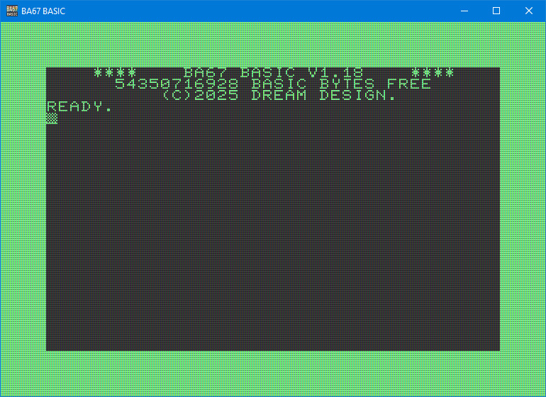
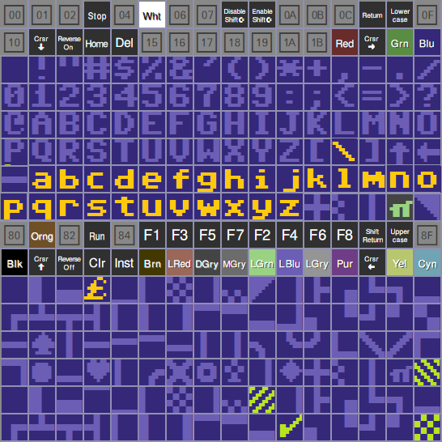

# BA67 - 80s BASIC Interpreter
Visit the project Homepage: [www.ba67.org](https://www.ba67.org).

# Contents
<!-- do not edit TOC_START and TOC_END lines. -->
<!-- See markdown_parser.h -->
<!-- TOC_START -->
- [Contents](#contents)
- [About](#about)
  - [Goal](#goal)
- [Syntax](#syntax)
  - [Case Sensitive](#case-sensitive)
  - [Spacing](#spacing)
  - [Quotes](#quotes)
  - [Numbers](#numbers)
  - [Unicode](#unicode)
  - [Variables](#variables)
- [Files](#files)
  - [Filesystem](#filesystem)
  - [Supported file formats](#supported-file-formats)
  - [D64 file storage](#d64-file-storage)
  - [Cloud file storage](#cloud-file-storage)
  - [boot.bas](#boot-bas)
  - [PETCAT](#petcat)
- [Editor](#editor)
- [Keywords, Commands, Functions](#keywords--commands--functions)
  - [Commands and Keywords](#commands-and-keywords)
    - [ABOUT](#about)
    - [AUTO](#auto)
    - [BAKE](#bake)
    - [BLOAD](#bload)
    - [BSAVE](#bsave)
    - [CATALOG](#catalog)
    - [CLOSE](#close)
    - [CLR](#clr)
    - [COLOR](#color)
    - [CHAR](#char)
    - [CHARDEF](#chardef)
    - [CHDIR](#chdir)
    - [CLOUD](#cloud)
    - [DATA](#data)
    - [DEF FN](#def-fn)
    - [DELETE](#delete)
    - [DIM](#dim)
    - [DUMP](#dump)
    - [END](#end)
    - [FAST](#fast)
    - [FIND](#find)
    - [FN](#fn)
    - [FNEND](#fnend)
    - [FOR](#for)
    - [GET](#get)
    - [GO](#go)
    - [GRAPHIC](#graphic)
    - [GOSUB](#gosub)
    - [GOTO](#goto)
    - [HELP](#help)
    - [IF](#if)
    - [INPUT](#input)
    - [KEY](#key)
    - [LET](#let)
    - [LIST](#list)
    - [LOAD](#load)
    - [MOVSPR](#movspr)
    - [NEW](#new)
    - [MODULE](#module)
    - [NETGET](#netget)
    - [NEXT](#next)
    - [ON](#on)
    - [OPEN](#open)
    - [PLAY](#play)
      - [Technical Background](#technical-background)
    - [POKE](#poke)
    - [PRINT](#print)
    - [PRINT USING](#print-using)
    - [QUIT](#quit)
    - [QSAVE](#qsave)
    - [RCHARDEF](#rchardef)
    - [READ](#read)
    - [REM](#rem)
    - [REMODEL](#remodel)
    - [RENUMBER](#renumber)
    - [RESTORE](#restore)
    - [RETURN](#return)
    - [RUN](#run)
    - [SAVE](#save)
    - [SCNCLR](#scnclr)
    - [SCRATCH](#scratch)
    - [SLOW](#slow)
    - [SOUND](#sound)
    - [SPRDEF](#sprdef)
    - [SPRITE](#sprite)
    - [STEP](#step)
    - [STOP](#stop)
    - [SYS](#sys)
    - [THEN](#then)
    - [TO](#to)
  - [Functions](#functions)
    - [ABS](#abs)
    - [ASC](#asc)
    - [ATN](#atn)
    - [CHR$](#chr-)
    - [COS](#cos)
    - [DEC](#dec)
    - [EXP](#exp)
    - [FRE](#fre)
    - [HEX$](#hex-)
    - [INSTR](#instr)
    - [INT](#int)
    - [JOY](#joy)
    - [LCASE$](#lcase-)
    - [LEFT$](#left-)
    - [LEN](#len)
    - [LOG](#log)
    - [MAX](#max)
    - [MID$](#mid-)
    - [MIN](#min)
    - [MOD](#mod)
    - [PEEK](#peek)
    - [PEN](#pen)
    - [PETSCII$](#petscii-)
    - [POS](#pos)
    - [POSY](#posy)
    - [RIGHT$](#right-)
    - [RND](#rnd)
    - [SGN](#sgn)
    - [SIN](#sin)
    - [SPC](#spc)
    - [SQR](#sqr)
    - [STR$](#str-)
    - [TAB](#tab)
    - [TAN](#tan)
    - [UCASE$](#ucase-)
    - [VAL](#val)
    - [XOR](#xor)
  - [Reserved Commands](#reserved-commands)
- [ANNEX](#annex)
  - [A - ABC Music Notation](#a---abc-music-notation)
    - [ABC Music Notation - Basics](#abc-music-notation---basics)
    - [Basic Structure](#basic-structure)
    - [Example:](#example-)
    - [Key Components:](#key-components-)
    - [Notes & Notation](#notes---notation)
    - [Chords & Decorations](#chords---decorations)
    - [Instruments](#instruments)
    - [Multi-Voice](#multi-voice)
    - [Editors](#editors)
    - [More Features](#more-features)
  - [B - Build, Using the Source Code](#b---build--using-the-source-code)
    - [CHARDEF](#chardef)
    - [HTML5](#html5)
  - [C - Cloud](#c---cloud)
  - [D - Developers](#d---developers)
  - [E - Escape (Control) Characters](#e---escape--control--characters)
  - [F - The Newline Dilemma](#f---the-newline-dilemma)
  - [G - Going from PETSCII to Unicode](#g---going-from-petscii-to-unicode)
  - [H - Hardcore Assembler Language](#h---hardcore-assembler-language)
  - [I - Internal Memory Model (PEEK and POKE)](#i---internal-memory-model--peek-and-poke-)
  - [Z Known bugs](#z-known-bugs)
- [Disclaimer](#disclaimer)
<!-- TOC_END -->

# About
BA67 (pronounced BASIC SEVEN) is a standalone BASIC interpreter,
that can be used as a daily tool on a personal computer.

It is inspired by the Commodore BASIC V7 ©1977 from the C128.
Three times the digit 7 led to it's name BA67.



If you're familiar with the C64/C128, you will quickly find
yourself comfortable with this interpreter. But BASIC is also
a very easy to learn programming language as well as an
operating system. So it suits perfectly for beginners as
well.

Many have programmed BASIC interpreters before, so why
another? Well, they all had some sort of limitations,
or were written in some strange language that I don't like.

This BASIC is compatible with COMMODORE's BASIC V7,
but also features some improvements.

Here are the key features:
- Compatible with the famous Commodore BASIC
- Can even run 6502 assembler subroutines
- Can load and save .prg files. Even in .d64 files
- GOTO/GOSUB labels (backwards compatible!)
- Variable names can be longer than 2 characters
- Dictionaries (key/value pair lookup tables)
- Unicode strings (no PETSCII or other exotic char sets)
- Full Unicode character set (even emoji end stuff)
- LIST provides syntax highlighting
- 64 bit precision for numbers
- 64 bit integers
- Supports scrolling through text beyond the visible screen area
- Modular programming (See keyword [MODULE](#module))
- Direct access to your local file system
- Easy access to proprietary cloud storage (See [CLOUD](#cloud))
- Get data from the internet (See [NETGET](#netget))
- Written in C++ (using some C libraries)
- Very easy to use as a scripting language in your projects
- Easy to port to other platforms
- HTML5 port
- Liberal license


-------------------------------------------------------------
## Goal
Back in the 80s, everyone could start a computer and program
a simple
```
10 PRINT "HELLO WORLD"
20 GOTO 10
```

These days there are so many languages and programs to
install before the fun starts, that many do not even bother
to try it.

The goal of this project is to get people to start
programming.

It aims to provide a BASIC language, that sticks to a very
widespread standard, keep backwards compatibility and focus
on an easy to learn language with easy to understand syntax
and few keywords.

Keeping the backwards compatibility also enables you to have
AI generators answer your questions.

Complex operators, module definitions, structures and
inheritance are excluded on purpose. Yet, the language
should offer a modular approach for complex programs
without introducing complex syntax.

The very final goal would be to have a standalone hardware,
that boots to this BASIC.

It features a screen editor that should behave as the retro
one does.

Graphics and sound were added.

For the graphics an 40x25 character graphics with 16 colors
is set. Each character is monochrome or multicolor.
Characters can be easily generated with the `CHARDEF`
command and supports the full Unicode range
(uses a map internally).

For the sound, the ABC music notation is used. For sound
effects, DrPetter's SFXR is used. See [PLAY](#play) and
[SOUND](#sound).

-------------------------------------------------------------
# Syntax
This interpreter tries to imitate and extend
COMMODORE's BASIC V7.

## Case Sensitive
The parser is case sensitive, but the line input uppercases
everything outside of quotes for convenience.

## Spacing
Keywords must be separated with spaces, operators or braces.
The COMMODORE allowed `LETTER=1`, which was interpreted as
`LET TER=1` instead of `LET LETTER=1`. Also `PRINT LETTER`
was not possible, because the LET part was interpreted as a
command instead of the variable name.

In order to avoid confusions, this BASIC requires separating
commands from variables.

If you load a '.prg' program file, the spaces will be added
automatically. Attention: This might cause lines to be
longer than 80 characters - which is not supported by the
8 bit computers.

## Quotes
You can use double and single quotes. This way it's easier
You can use double and single quotes. This way it's easier
to use quotes in a string. The following is perfectly legal:
```
PRINT "Print 'single quotes' is easy"
PRINT 'but: "double quotes" is, too.'
```

> ! Single quotes break compatibility with Commodore BASIC V7.0

In BASIC V7.0, only double quotes are accepted. To escape
these, you'd have to print `CHR$(34)`.


-------------------------------------------------------------
## Numbers
Number constants can be given in scientific notation
(-1.3e-5) or as floating point input (1.23). The decimal
separator is the period symbol, regardless of the computer's
locale settings.

Internally, BA67 uses 64 bit double values. But for comparing
equality like `IF A=B`, if the difference between the numbers
is smaller than 2.32830644e-10 they are considered equal.
That's the smallest floating Commodore BASIC can
distinguish.

Integers can be given up to 64 bits. A prefixed `$` is
interpreted as a hex number. `a = $7ffffff`.

Commodore allowed the dot `.` to be interpreted as zero.
BA67 can allow this with the options.dotAsZero=true set.
That's the default. Please don't do this in new projects.
People did this because parsing '.' was faster than '0' in
Commodore BASIC.

-------------------------------------------------------------
## Unicode
This interpreter has full Unicode support. Even emoji 😀.
The Windows console, however, cannot display characters
above 0xffff and will display two characters instead ☹.

LEN, MID$ etc. work with Unicode code-points, so
LEN("äöü") = 3, even though the parser stores 6 utf8
bytes, internally.


-------------------------------------------------------------
## Variables
Variables can be double, integer or string variables and 
arrays of these.
Integers have a % postfix, where strings end with $.
The double variable 'a' and the integer variable 'a%' are
two separate variables. Also, arrays can have the same name
as non-array variables and are treated as separate variables.
(That's compatible with CBM BASIC)

There are built-in variables, that will be updated before
each statement is evaluated. These are:

| Variable   |  Value                                                      |
| ---------- | ----------------------------------------------------------- |
| TI         | current system time in 1/60 sec.                            |
| TI$        | current time in format HHMMSS. (Can be set. Will affect TI) |
| ST, STATUS | file I/O status. Memory at address $0090(144)               |

In CBM BASIC, the variable `TI, TIME` and `TIMER`, even 
`TIMEGOESBYSOSLOWLY` are the same variable! When importing
.prg files of old code, BA67 will not take care of this.
You need to manually adjust the code.

-------------------------------------------------------------
# Files
## Filesystem
Internally, the file system is no case sensitive. Even on
operating systems that are! So you can load "GAME.BAS", even
if the file is names "game.bas" on the drive. Same goes for
overwriting existing files.

In most cases you can use wildcard characters `*` and `?`
for loading existing files.

## Supported file formats
BA67 can load .prg files from the C64 (BASIC V2)and
C128 (BASIC 7.0) natively. The filename foe `QSAVE` is
changed to a '.bas' file extension, though, since some
graphical characters are mapped to Unicode and cannot be
mapped back to PETSCII properly, yet.

You can, however, save as a '.prg' file that you can load
in your emulator (try drag & drop) or edit it with
[DirMaster](https://style64.org/dirmaster).

All other files are loaded as UTF-8 text files. a UTF-8
[BOM](https://en.wikipedia.org/wiki/Byte_order_mark)
is accepted but mandatory. Saving will write UTF-8 without BOM.

When saving to a .prg file (only for export - don't use this
as your development format!), the Unicode characters in
strings are mapped back to PETSCII. See [Annex G](#annex)
for details.

## D64 file storage
Using `CHDIR "filename.d64` you can use a D64 file as if
it was a directory. You can load ans save files to the d64
disk. Beware, the support is very limited. Some files will
not be restored. Deleted files really get deleted.
The d64 file is not updated. Rather, it will be completely
written from scratch using the file data that was read from
the disk file before writing to it.

Saving files is always as type PRG which is the tokenized
BASIC file format. You might lose data from your BA67 file
because not all Unicode code points can be converted,
obviously.

## Cloud file storage
With `CLOUD` you can specify a web server, that BA67 can use
as a remote drive. There are no subdirectories on a cloud
storage.
You simply `CHDIR "CLOUD"` to navigate the current directory
to the previously defined cloud storage.
See the [CLOUD](#cloud) command for details.

## boot.bas
The C++ class that derives from the C++ class `Os` should
set the start directory to a location, where BASIC programs
are to be saved.

When starting, the interpreter will load and run the
file "boot.bas" from the start directory and call `NEW`
to clear all variables.

You can edit and save this file for your needs and e.g.
adjust the `KEY` shortcuts etc.

The interpreter can load files without line numbers and will
numerate them automatically.

## PETCAT
!! TODO do not use this anymore - BA67 can load .prg files !!

If you add the line number 1 and start with the comment
`1 REMBA67` - no spaces between `REM` and `BA67` - then
the interpreter switches to the Commodore style parsing and
reformats your code with spaces.

The line `1 REMBA67` also can add more keywords. These are
 - `PETCAT` parse the `petcat` program's escaping of
            characters. Use e.g.
            `petcat -70 -f -o "output.bas" -- "input.prg"`

After loading, the parser returns to the default behavior.
Don't forget to backup and remove line `1` before saving.

See [Annex G](#annex) for mapping PETSCII to Unicode.

-------------------------------------------------------------
# Editor
The editor imitates the C64/C128 text editor. Use the `ESC`
key to abort a program execution or the listing of `CATALOG`
or `LIST`.

The editor retains a scroll-back history of off-screen lines,
which you can scroll through.
It is cleared by RUN or by printing a screen-clear character.

The F1 .. F12 keys are pre-assigned with some BASIC keywords
and can be configured using the KEY command.

Use Alt+INS key to toggle between insert mode and overwrite
mode. Use the INS key alone to insert a single character
space.

When you press `CTRL+1..8` or `SHIFT+CTRL+1..8`, a special
character is printed, that advices the interpreter to change
the text color.
Pressing `ALT+CRSR` or `ALT+HOME` prints a character that
moves the cursor.

`ALT+END` is a character to clear the screen.

The `Pause` key saves the current state to a snapshot file.
You can recover that state any time with `Shift-Pause`.

Annex D shows the list of control characters.

The Scroll Lock and the Shift keys can be used to pause
commands, that list large texts to the screen. Try the `LIST`
command or `CATALOG` on large directories.

When you press Ctrl+'.', the BA67 starts the emoji-panel
program if it can find it. Here you can pick an emoji or
Unicode character and insert it at the current cursor
position. You can find that program as well on
[github](https://github.com/KungPhoo/stdout-emoji-panel).

-------------------------------------------------------------
# Keywords, Commands, Functions
The following is a list of the BASIC hard-coded language
tokens you can use to write programs. They are split in 3
groups, where the first two can be considered as one - only
if you want to look at the source code, you will find these
two different groups. So, here keywords and commands are
put in the same list for a better reference.

Functions always take at least one argument in braces.

-------------------------------------------------------------
## Commands and Keywords
### ABOUT
**Usage:** `ABOUT`

Prints the 'about this project' and license message.

### AUTO
**Usage:** `AUTO [n]`
Enables automatic line numbering. This aids you when writing
programs by printing the next line number at the input prompt
after a line has been programmed by adding `n` to the
previously entered line number.

Calling AUTO with no argument disables this feature.

When a line already exists, BA67 will print the contents of
this line to prevent you from overwriting existing code.


### BAKE
**Usage:** `BAKE`

BA67 provides a compatible way to use labels for `GOTO` and
`GOSUB` calls.

The original CBM BASIC interpreter ignores any data behind
the GOTO number until the next command. So we can append a
label text after the number and the program still works.

The `BAKE` command finds such GOTO/GOSUB line numbers and
replaces them with the correct line numbers.

In order to provide a label, just use a line with a `REM`
comment, that only includes the label surrounded by two
minus characters like this:
```
REM --LABEL--
```
The label must not start with a number and only contain
A-Z,a-z,0-9 and _ as characters. No spaces. The labels
are case sensitive! Better only use uppercase letters.

Attention: The does not work with `ON..GOTO/GOSUB` in
CBM BASIC, so BA67 does not support it either.
**Usage:** `REM COMMENT. --LABEL-- FOR BAKE`


### BLOAD
**Usage:** `BLOAD filename$, address`

Load a binary file to the given memory address.
The end must not exceed the internal memory or an error
will be printed.


### BSAVE
**Usage:** `BSAVE filename$, startAddress, endAddress+1`

Saves the memory from startAddress to endAddress excluded
to the given file.
The endAddress is the first byte that's not written anymore.


### CATALOG
**Usage:** `CATALOG [filter$]`

Lists all files and directories of the current directory.
Optionally, you can provide a wildcard filter string.


### CLOSE
**Usage:** `CLOSE fileno`

Closes a file handle.

### CLR
**Usage:** `CLR`

Clears all variables.

### COLOR
**Usage:** `COLOR source405, color1`

Set text or background color. The `source` is an indicator
what color to change.
```
0 or 6: Background (C128: 0)
1 or 5: Text color (C128: 5)
4     : Border color (only if available)
```
The default `color` values are:
- 1 Black
- 2 White
- 3 Red
- 4 Cyan
- 5 Purple
- 6 Green
- 7 Blue
- 8 Yellow
- 9 Orange
- 10 Brown
- 11 Light Red
- 12 Dark Gray
- 13 Medium Gray
- 14 Light Green
- 15 Light Blue
- 16 Light Gray

If you want to **redefine** a color, the syntax is:
`COLOR color, red, green, blue`
Where `red`, `green` and `blue` are values from 0 to 255 or
$00 to $ff.

**NOTE** If you break the program with the `ESC` key, the
colors are reset to the defaults.

In order to change the background and text color for a
a text on the screen, one technique is

`COLOR 5, 3 : CHAR 8, 10, 10, "M", 1`

In Detail:
- Set text color to 3 (red)
- Invert the colors (last argument of `CHAR`)
- Print "M" with text color 8 (yellow)
- Result: yellow M on red background

In C64/C128 BASIC, the background color could be changed with
`POKE 53281, color0`. For BA67 even `POKE $D021, color0`.
The border color can be set with `POKE 53280, color0`.

BA67 and C64 can set the text color with `POKE 646, color0`.
The C128 pendant would be `POKE 241, color0`, where
`color0` is the zero based color index.

BA67 uses the C64 memory layout. The high nibble at address $286(646),
however, is set to the text background color as well!
This does not harm the C64, but allows BA67 to have a separate background
color per character.

Whenever you change the address $288, the high nibble will be taken
from $D021. The C64 VIC-II will only interpret the low nibble. The
kernal does not mask it, so it should not break compatibility.
BA67 will display the proper background color for every printed character
then. If you change the background color, better clear the screen
afterwards if you plan to run code on the real C64 as well.

### CHAR
**Usage:** `CHAR color, column0, line0, text$[, inverse]`

Positions the cursor position to `column,line`, where the top
left screen corner is at position `0,0`.
Then prints the given string at that position and leaves the
cursor at the end of the printed string's position.
Other BASICs have a command `LOCATE` or `PRINT AT` for this.

The parameter `color` was ignored on the C128, but here it is
used as the text color index. See [COLOR](#color) for possible
values from 0 to 16. The color 0 (or omitting the parameter)
uses the current text color.

The command will leave the cursor at the end of the text
and restore the current text color.

### CHARDEF
**Usage:** `CHARDEF char$, bytes [, more bytes]`

Defines the pixels of a character symbol.

**Monochrome**

You can define any Unicode character with this command.
Each parameter is a byte (8 bits), that describe the
horizontal pixels of a line. You must pass 8 lines.

Alternatively, you can pass all 8 bytes as a single number,
since BA67 supports 64 bit integers.
So `CHARDEF "A", $ff22334455667788` is valid.

Use the `CHR$()` command, if you want to give the Unicode
code point as a value.

Here's an online generator for monochrome chars:
[matrix-emoji](https://jorydotcom.github.io/matrix-emoji/).

**Multicolor**

If your pixel size ix 8x8 (default) and you pass 8 values
of 32 bits. They are interpreted as 16 bit color indices.
So each byte represents 2 pixels. In order to distinguish
these 8 values from the 8 bytes of a monochrome character,
one value must be greater than $ff.

Pay attention: The color values are 0..15 - instead of the
color values in `COLOR`, which are 1 based.

Example:
```basic
10 CHARDEF "$",24,36,32,112,32,98,92,0
20 READ C$, A,B,C,D,E,F,G,H
30 CHARDEF C$, A,B,C,D,E,F,G,H
40 PRINT "$$$ ###"
100 REM MULTICOLOR IMAGE
110 DATA "#"
120 DATA $11111144
130 DATA $11144444
140 DATA $11144444
150 DATA $14444444
160 DATA $14444446
170 DATA $14446666
180 DATA $44446666
190 DATA $44466666
```


`CHARDEF "#", $00, $11, $11, $00,  $11, $22, $22, $11,  $12, $33, $33, $21,  $13, $44, $44, $31,  $14, $55, $55, $41,  $15, $66, $66, $51,  $01, $77, $77, $10,  $00, $18, $81, $00`

You can read the bits of a character with the
keyword `RCHARDEF`.


**Example**
```basic
10 CHARDEF "$",24,36,32,112,32,98,92,0
20 PRINT "$$$$"
RUN
```

**NOTE** If you break the program with the `ESC` key, the
characters 0..127 (ASCII set) reset to the defaults.


### CHDIR
**Usage:** `CHDIR directory`

Change into the given directory.

The CHDIR command also supports wild-card characters.
use `CHDIR ".."` to go one directory level up.

BA67 uses the forward slash `/` on all platforms as
as directory separator.

The spacial command `CHDIR "CLOUD"` is described in the
`CLOUD` command.


### CLOUD
**Usage:** `CLOUD email$ [, server$]`

Specifies the cloud storage parameters.
BA67 can load and write files to a cloud storage. See the
file `cloud.php` in the `www.ba67.org/cloud` folder of the
source code to host our own cloud service.

When you `CHDIR "CLOUD"`, all read and write access will
be done on the cloud you provided. You can go back to
your local file system with `CHDIR "."`.

If you have a local directory "CLOUD" and want to change
to that directory, you can do so with  `CHDIR "./CLOUD"`.

See [Annex C](#annex) for more details.

### DATA
**Usage:** `DATA value, value, string, "string with spaces", ...`

Provides data variables to be used with the READ keyword.
Empty values `DATA ,,,` are also allowed. But, please don't
use them.

### DEF FN
**Usage** `DEF FN NAME(ARG[, ARG2, ...]) = ARG+ARG2...*`

Provides a way to define user functions, that can be called.
Internally, the function name always starts with FN, so this
is the only place, where `FN FOO` and `FNFOO` are valid and
equal.

BA67 allows Dartmouth-style multiline-BASIC functions
and multiple arguments for functions. Variable names that
that match argument names are restored after the function call.

Here's an example:
```
10 REM == MAIN PROGRAM ==
20 A=33: X=44: Y=55
30 REM == FUNCTION DEFINITION ==
40 DEF FN A(X,Y)
50     PRINT "XxY=";X;"x";Y;"=";X*Y
60     FNA=X*Y
70 FNEND
80 REM == MAIN PROGRAM CONTINUES ==
90 PRINT "CALLING FUNCTION..."
100 PRINT FNA(3,4)
110 PRINT "RESTORE AFTER CALL: A";A;" X";X;" Y";Y
```
> ! Multiple arguments and
>   multi-line function bodies
>   break compatibility with Commodore BASIC V7.0

### DELETE
**Usage:** `DELETE from [- to]`

Deletes the line numbers in the given range.


### DIM
**Usage:** `DIM var(size)`

Allocates an array with the specified size.

Example:
```basic
DIM A(10)
```

If the size is omitted, the CBM BASIC yields a
`SYNTAX ERROR`. BA67 will set the array as a
dictionary. You can then use any kind of values
as the key and store data.

**Example:**
```
10 DIM A$() : REM CREATE DICTIONARY
20 A$("KEY1") = "VALUE 1"
...
30 PRINT A$("KEY1")
DUMP
```

### DUMP
**Usage:** `DUMP [var][,var ...]`

Prints all variable values to the current output device.

Optionally, you can specify only the variable name to
dump.

### END
**Usage:** `END`

Terminates program execution.

### FAST
**Usage:** `FAST`

Enables fast mode for this `MODULE`. That's the default
speed. No delay will be added. See also [SLOW](#slow).

### FIND
**Usage:** `FIND "print*hello world"`

Searches the current module's program listing for the given
search string. The search is performed case-insensitive
and you can use the wild-cards `*` and `?`.
A `*` is appended at the front and the back, internally.

The command will act as `LIST`, but only list the lines where
the search string was matches.

### FN
See the `DEF FN` description, please.

### FNEND
Used to end a multi-line function definition.
See the `DEF FN` description, please.

### FOR
**Usage:** `FOR var = start TO end [STEP increment]`

Begins a loop with an optional increment.

Example:
```basic
FOR I = 1 TO 10 STEP 2
```

Internally a call stack is used for all kind of loops.

[C64-wiki.com](https://www.c64-wiki.com/wiki/FOR) states:
C64 BASIC deals with information about FOR-NEXT loops on
the return stack in one of four ways:

- When the `FOR-NEXT` loop terminates normally,
    the information is removed from the return stack.
- When a program encounters a `NEXT` statement with an
    explicit loop variable, all inner loops are
    cancelled and their information removed from the
    return stack.
- All `FOR-NEXT` loops commenced within a subroutine are
    terminated and their information removed
    from the return stack when the program encounters a
    `RETURN` statement.
- If a `FOR` statement is encountered, any existing loop
    using the same variable name along with
    any subsequent unfinished `FOR-NEXT` loops are
    terminated and their information removed from the
    return stack.

### GET
**Usage:** `GET [file-number#, ] a$ [, b$, ...]`

Gets a key press from the keyboard buffer or a file.
Will return an empty string, if the buffer is empty
or the end of the file was reached. (ATTENTION: The
original BASIC would repeat the last read character)
You have to test the `STATUS` variable for the
end-of-file indicator `STATUS AND 64` or any file
error `STATUS <> 0`.

Using a file indicator `#N,`, you can write
to a file or the printer etc. See `OPEN` command.


### GO
**Usage:** `GO 64`

Runs the original C64 BASIC interpreter in memory.
It's the same as calling `SYS $FCE2`.


### GRAPHIC
**Usage:** `GRAPHIC mode5`

Changes the current graphics mode. Currently only two modes
are supported:
 - `1..4` Switches back to default 40 column mode
 - `5`    Switches to 80 column mode

In the 80 column mode, each character still is 8x8 pixels.
However, the display is scaled to it looks like they're 8x16
pixels. You can change that in the code. See also [CHARDEF](#chardef).

### GOSUB
**Usage:** `GOSUB line`

Calls a subroutine at the specified line number. Execution
resumes after a `RETURN`. The `FOR-NEXT` stack from inside
the subroutine is popped from the stack.

See the [FOR](#for) command for how the call stack is maintained,
internally.

See the [BAKE](#bake) command for how to use labels instead of
line numbers.

Example:
```basic
GOSUB 200
```

### GOTO
**Usage:** `GOTO line`

Jumps to the specified line number unconditionally.

Example:
```basic
GOTO 100
```

See the [BAKE](#bake) command for how to use labels instead of
line numbers.

### HELP
**Usage:** `HELP command`

Prints a small information about how to use the command.

### IF
**Usage:** `IF condition THEN statement|line_number_`

Executes `statement` if `condition` evaluates as true. If
the condition is false, the execution of this line stops.
This differs from other BASICs.

Example:
```basic
IF X = 10 THEN PRINT "Hello"
```

### INPUT
**Usage:** `INPUT [file-number# , ] var [, var, ...]`

Prompts for user input. You can use the file number
to read strings from a file. The separators ,;: and 
CHR$(13), CHR$(10) will break a string. The separators
are not part of the returned strings.

If the first character of the string is a quote ("),
everything up to the newline character is read. The
starting and ending quote characters are not returned.

Example:
```basic
INPUT X
```

### KEY
**Usage:** `KEY [index, string]`

The KEY keyword lets you specify the text, that's printed,
when you press any of the F1..F12 function keys. Without
arguments, the keyword lists the current keyboard shortcuts.

### LET
**Usage:** `LET var = expr`

Assigns a value to a variable. `LET` is optional.

Example:
```basic
LET X = 5
```

### LIST
**Usage:** `LIST [from][-][to][MODULE]`

Displays the program listing. Optionally, a line
number range can be provided.

I only the `-` is given, the last from/to range
will be listed again.

`LIST MODULE` lists all loaded modules. See [MODULE](#module).

`LIST BAKE` will list all `BAKE` compatible remarks. See
[BAKE](#bake).

### LOAD
**Usage:** `LOAD "basic*folder/*.bas"`

Loads a program from the disk drive. You can use the forward
slash character to specify directories like `dir/file.bas`.
Wild-card characters `*` and `?` are supported in folders as
well as in file names.

### MOVSPR
**Usage:** `MOVSPR number, x25, y50`

Moves a sprite to a given screen location. The position
(0, 0), however is in the border. The top left coordinate
of the first visible character is (25, 50).

### NEW
**Usage:** `NEW`

Clears the current program from memory.

### MODULE
**Usage:** `MODULE name`

Modules are a great way to modularize complex code and reuse
existing listings. The interpreter holds a list of variable
spaces for each module as well as a program counter
(listing execution position) for each module.

With the MODULE keyword you can switch into the variable
space of another module. The program counter, however, still
is in the old module! This way you can modify code in the
sub-module. Calling RUN execute the module's code until it
calls END or reaches the end of it's listing.

After RUN or END, the current module is switched back to the
calling module.

It's a common technique to switch to a module, `LOAD` the
code, then END back to the main program. When required,
the module code can be executed using `MODULE name: RUN`.

Passing arguments back and forth can be done by prefixing
the variable name with the module name followed by a period
operator. `module.varname = 123`, which can be called from
any other module.

Example:
Type this example line by line into the interpreter:
```basic
10 M = 1
20 PRINT "IN MAIN "; M  : REM M=1
30 MODULE MYMOD
40 M = 2                : REM MYMOD.M=2
50 RUN                  : RUNS MYMOD'S CODE
60 PRINT "IN MAIN "; M  : REM M=1

REM THE MODULE KEYWORD WILL
REM BRING US INTO THE MODULE'S SPACE
MODULE MYMOD


10 PRINT "IN MODL "; M    : REM (MYMOD.) M=2
30 M=3                    : REM (MYMOD.) M=3
40 PRINT "IN MODL "; M    : REM (MYMOD.) M=3
50 END                    : REM BACK TO MAIN MODULE

REM THE END KEYWORD WILL
REM BRING US BACK TO THE MAIN MODULE
END

REM NOW RUN THE MAIN PROGRAM
RUN
```

Output:
```
IN MAIN 1
IN MODL 2
IN MODL 3
IN MAIN 1
```

### NETGET
***Usage:** `NETGET url$, c$`

Downloads a website and stores the returned bytes in c$,
which is interpreted as a UTF-8 string when `PRINT-ing`.

It's best to provide the protocol (https:// or http://)
at the beginning of the URL. If it's omitted, https://
will be tried first, then http://.

### NEXT
**Usage:** `NEXT [var]`

Marks the end of a `FOR` loop, increasing `var` by `STEP`.

Example:
```basic
NEXT I
```

### ON
**Usage:** `ON expr GOTO/GOSUB line1, line2, ...`

Transfers execution to one of the specified lines based on
the value of `expr`.

Example:
```basic
ON X GOTO 100, 200, 300
```

### OPEN
**Usage:** `OPEN fileno, device=1, secondary=0, "filename , FILETYPE , MODE_RW"`

Opens a file for reading or writing.

The device has the following meanings:
- 1,8..15: hard disk access
- 4: printer (print to stdout)
- 5: printer (print to stderr)

The secondary parameter is currently only for backwards
compatibility and is ignored.

When reading, wild-card characters are supported for the
filename. The mode "R" for reading or "W"
for writing must be part of the filename argument and
separated from the file name with an comma character.

Optional, you can specify a file type with a comma at
the file name. The file type is appended to the file-
path as the file extension, then. The following file
extensions are supported: PRG, SEQ, USR and REL.
Only the first character must be specified.

REL files currently are not supported (random access files).

Use `PRINT#1, "TEXT"` to print to the opened fileno #1.

Don't forget to `CLOSE` the file afterwards.

### PLAY
**Usage:** `PLAY ABC_notation$`

The PLAY command plays a music score in the background of
your program. The music string is in ABC music notation.

See the [annex](#annex) for details.


#### Technical Background
BA67 uses two command line tools for the `PLAY` command. Both must
be installed and in the PATH variable. On Windows, the programs must
be relative to the executable "bin\BA67.exe":
"..\3rd-party\abcMIDI\bin\abc2midi.exe"
"..\3rd-party\fluidsynth\bin\fluidsynth.exe"

ABC2MIDI is a GPL software and will thus not be distributed.
[abcmidi](https://ifdo.ca/~seymour/runabc/top.html) or
[github](https://github.com/sshlien/abcmidi)

For Fluidsynth, also a soundfont file must be present.
Currently BA67 searches for:

On Windows:
"..\3rd-party\fluid-soundfont-3.1\FluidR3_GM.sf2"

otherwise
"FluidR3_GM.sf2"
TODO: Find a better place where to install that file.

If any of these files cannot be found, BA67 uses a very, very
primitive ABC music notation parser, that generates the melody
using a sine wave. So, if `PLAY "C D E"` sounds terribly bad,
you're probably missing any of the above files.


### POKE
Puts a byte to a virtual memory address. This is only for
compatibility. The `PEEK` command can retrieve the value.
BA67 internally has 32 bit  values for each address.
So you can `POKE` larger values to an address. This is
required to display Unicode screen characters.

See the [Annex I](#annex) for supported addresses.

**Usage:** `POKE address, value`

Example:
```basic
POKE 1234, 128
```

### PRINT
Outputs text or values to the screen or a device.
You can use special control characters.
See the Annex D for more details.

Using a file indicator `#N,`, you can write
to a file or the printer etc. See `OPEN` command.

**Usage:** `PRINT [file-number#, ] expr [[,|;| ] expr ...]`

Example:
```basic
PRINT "Hello, World!"
```

### PRINT USING
**Usage:** `PRINT USING format; expr [, expr ...]`

Outputs text or values as a formatted string to the screen.

Example:
```basic
10 PRINT USING "+##";1                 : REM "+ 1"
20 PRINT USING "#.##+";-0.01           : REM "0.01-"
30 PRINT USING "-.##";-0.1             : REM "-0.10"
40 PRINT USING "##.#-";1               : REM " 1.0"
50 PRINT USING "####";-100.5           : REM "-100"
60 PRINT USING "####";-1000            : REM "****"
70 PRINT USING "#.##";-4E-03           : REM "****"
80 PRINT USING "##.";10                : REM " 10"
90 PRINT USING "###.##"; 100           : REM "100.00"
100 PRINT USING "##.##";10.4           : REM "10.40"
110 PRINT USING "#,###.##";10000.0009  : REM "********"
120 PRINT USING "##,##";-1             : REM "  -1"
130 PRINT USING "##,##";-10            : REM " -10"
140 PRINT USING "##,##";-100.9         : REM "-101"
150 PRINT USING "+#.#^^^^";1           : REM "+1.0e+00"
160 PRINT USING "#^^^^";1.5E+11        : REM "2e+11"
1010 PRINT USING "##.##";"CBM"         : REM "CBM"
1020 PRINT USING "X##=##X";"CBM"       : REM "X CBM X"
```

### QUIT
**Usage:** `QUIT`

Quits the interpreter.

### QSAVE
**Usage:** `QSAVE`

Saves the current listing as the name that was last
loaded or saved.

### RCHARDEF
**Usage:** `RCHARDEF char$, mono, bits1, bits2, ..., bits8`

Reads the pixels for a character image. See [CHARDEF](#chardef)
before reading this.

The `mono` parameter will be filled with -1 (yes, mono) or
0 (no, multicolor).
The `bits1..bits8` will hold either 8 bit values or 32 bit
values for each line of the character pixels.

### READ
**Usage:** `READ var[, var [, var2] ]`

Reads a variable from the next DATA keyword.

### REM
**Usage:** `REM --LABEL-- or comment`

Adds a comment in the program. See the [BAKE](#bake) command
for special comments that can be used as `GOTO` labels.

Example:
```basic
REM This is a comment
```

### REMODEL

This is treated as a `REM` in classic BASIC, but BA67
uses it to set internal options. The following options
are implemented:

+-----------+---------------------------------------------+
|  Option   |  Description                                |
+-----------+---------------------------------------------+
| SPACING   | Interpreter requires space separated tokens |
+-----------+---------------------------------------------+
| ZERODOT   | The dot is interpreted as 0.0               |
+-----------+---------------------------------------------+
| UPPERCASE | GET and INPUT return only upper-case strings|
+-----------+---------------------------------------------+
| COLORLIST | Syntax highlighting for LIST command        |
+-----------+---------------------------------------------+

If you omit the parameters, a list of all options and their
current value will be printed.

**Usage:** `REMODEL option, value`


### RENUMBER
Renumbers the program lines.

**Usage:** `RENUMBER [new__start, increment, old__start, milestone]`

Where `new__start` specifies the first new line number to
use. The `old__start` parameter is the first line of the
current listing you want to start renumbering from.
With `increment`, you specify the leap per line.
The default is 10.
With `milestone` you can specify what line numbers
you want to keep and restart incrementing from this
number, then. The default is zero - no milestone.

*DO SAVE YOUR WORK* before you renumber the listing.
At least save a snapshot with the `Pause`-key .

Please also see the [BAKE](#bake) command for using labels
instead of line numbers.

**Example:**
```basic
1 REM START
2 PRINT "HELLO"
100 REM SUBROUTINE-MILESTONE
...
180 RETURN

RENUMBER 1, 20, 100
LIST

20 REM START
40 PRINT "HELLO"
100 REM SUBROUTINE-MILESTONE
...
180 RETURN
```

### RESTORE
**Usage:** `RESTORE [line]`

Restores the next READ's DATA to the given line number or,
if omitted, the start of the program.

### RETURN
**Usage:** `RETURN`

Returns from a subroutine invoked with `GOSUB`.

Example:
```basic
RETURN
```

### RUN
**Usage:** `RUN [start_line_number]`

Executes the program. Optionally a line number can be passed
as the start of the processing.

If the program switched to a `MODULE` earlier, this will set
the active program listing to the module's code.

Optionally, a line number can be specified.


### SAVE
**Usage:** `SAVE "test.bas"`

Saves the BASIC program of the current module to a file on
the disk drive. The file extension ".BA67" is recommended.
If no file extension is given, ".BAS" will be appended.

If you're saving to the cloud, you can write-protect your
file with the ",P" parameter in the file name. Once set,
the file can not be overwritten or deleted without this
password.

Example:
`SAVE "EXAMPLE.BAS,P-your-password-here-"`

This parameter has no effect on the C128 and is, thus,
backwards compatible.

See also [QSAVE](#qsave).


### SCNCLR
**Usage:** `SCNCLR [n]`

Clears the screen and puts the cursor in the top left corner.
The optional parameter is ignored.

### SCRATCH
**Usage:** `SCRATCH "FILENAME"`

Scratches (deletes, removes, unlinks) a file from the current
directory. It also works on the CLOUD.

You are allowed to use wildcard characters `?` and `*`.

In direct mode `ARE YOU SURE (Y/N)?` will be requested, which
has to be answered with 'Y' for every file to be deleted.

Use this command really with caution. I will not take any
liability if the command might cause damage to your data.


### SLOW
**Usage:** `SLOW`

Slow mode is enabled. This adds a delay for every
instruction to approximately simulate the speed of a C64.


### SOUND
**Usage:** `SOUND voice, play$`

Plays a sound in the background. The parameters are passed
as a string, that's separated by spaces, commas or colons.

The voice is one of the 64 voice channels to mix the sounds.

BA67 uses DrPetter's SFXR. More details on the parameters
can be found on his homepage:
https://www.drpetter.se/project_sfxr.html

Optionally different sound engines might be used during
compilation. See Build chapter in the [annex](#annex).

Here's the list of parameters:
```
*Wave Shape*
wave_type      : 0 = square, 1 = sawtooth, 2 = sine, 3 = noise

*Envelope*
env_attack   : [0 +1] Attack time
env_sustain  : [0 +1] Sustain time
env_decay    : [0 +1] Decay time
env_punch    : [0 +1] Sustain punch

*Tone*
base_freq    : [0 +1] Start frequency
freq_limit   : [0 +1] Min frequency cutoff
freq_ramp    : [-1+1] Slide (SIGNED)
freq_dramp   : [-1+1] Delta slide (SIGNED)

*Square wave duty* (proportion of time signal is high vs. low)
duty         : [0 +1] Square duty
duty_ramp    : [-1+1] Duty sweep (SIGNED)

*Vibrato*
vib_strength : [0 +1] Vibrato depth
vib_speed    : [0 +1] Vibrato speed
vib_delay    : [0 +1] Vibrato delay

*Filter*
filter_on    : [1/0] don't know if this has any influence.

*Low-Pass Filter*
lpf_resonance: [0 +1] Low-pass filter resonance
lpf_freq     : [0 +1] Low-pass filter cutoff
lpf_ramp     : [0 +1] Low-pass filter cutoff sweep (SIGNED)

*High-Pass Filter*
hpf_freq     : [0 +1] High-pass filter cutoff
hpf_ramp     : [0 +1] High-pass filter cutoff sweep (SIGNED)

*Flanger*
pha_offset   : [-1+1] Flanger offset (SIGNED)
pha_ramp     : [-1+1] Flanger sweep (SIGNED)

*Repeat*
repeat_speed : [0 +1] Repeat speed

*Tonal change*
arp_speed    : [0 +1] Change speed
arp_mod      : [-1+1] Change amount (SIGNED)

*Volume*
volume       : [0 +1] Sound volume
```

**Example:**
```basic
REM play noise wave with default values
SOUND 1, "wave_type:3"
```

### SPRDEF
**Usage:** `SPRDEF number, chars$`

Defines a sprite. You have 256 sprites to use. They are
overlaid over the character graphics and can be moved on
a per pixel basis.

In order to define a sprite, first you define characters.
Then you assign the character images to a sprite number.
A sprite consists of 3x2 character images.
You can select any color index to be transparent with the
3rd parameter. If you omit it, the sprite will not be
transparent.


### SPRITE
**Usage:** `SPRITE number, on, color, priority, x2, y2`

Changes the visibility and characteristics of a sprite.
The `on` parameter enables 1 or disables 0 the sprite.

If the bitmap is monochrome, the `color` sets the color
of the sprite. If it's a multicolor sprite, this sets
the transparent color index 1..16.

The `priority` parameter is currently not used.

The flags `x2` and `y2` enable 1 or disable 0 the scaling
of the sprite to twice it's size.

Sprites can be moved with `MOVSPR`.


### STEP
**Usage:** `FOR var=start TO end STEP increment`

Used in `FOR` loops to define an increment.
Example:
```basic
FOR I = 1 TO 10 STEP 2
```

### STOP
**Usage:** `STOP`

Stops the program, is if the escape key was pressed with the
`?BREAK IN line__number` message.

### SYS
**Usage:** `SYS "wget " + CHR$(22) + "www.ba67.org" + CHR$(22)`

If a string is given, the host system's command is executed.

It's required to have the command in quotes, so you can
use variables.

If a number is given, the assembler code at that memory
address is executed. See [Annex H](#annex) for details.

### THEN
**Usage:** `IF condition THEN expression|line` 

Used in conjunction with `IF` to specify the
action when the condition is true.
Example:
```basic
IF A > B THEN GOTO 100
```

### TO
**Usage:** `FOR var=start TO end [STEP increment]`

Used with `FOR` to specify the loop end value.
Example:
```basic
FOR I = 1 TO 5
```


-------------------------------------------------------------
## Functions
### ABS
**Usage:** `ABS(expr)`

Returns the absolute value of a number.

### ASC
**Usage:** `ASC("char")`

Returns the ASCII code of a character.

### ATN
**Usage:** `ATN(expr)`

Returns the arc-tangent of a number.

### CHR$
**Usage:** `CHR$(code)`

Returns the character corresponding to an ASCII code.

### COS
**Usage:** `COS(expr)`

Returns the cosine of an angle in radians.

### DEC
**Usage:** `PRINT DEC("FF")`

Converts a hex string to an integer number.
See also [HEX$](#hex$).

### EXP
**Usage:** `EXP(expr)`

Returns `e` (2.71828183..) raised to a power.

### FRE
**Usage:** `FRE(0)`

Returns the amount of memory for PEEK and POKE operations.
On a C64, this would print the memory available for your
BASIC program.

### HEX$
**Usage:** `PRINT HEX$( $ff001234 )`

Returns a string representation of an integer number.
See `DEC` to reverse it.

### INSTR
**Usage:** `position=INSTR(haystack$, needle$, [start__pos])`

Returns the first occurrence of `needle$` in `haystack$`.
The first character is the index `1`. A return value of
`0` indicates, that no match was found.

### INT
**Usage:** `INT(expr)`

Returns the integer portion of a number.

### JOY
**Usage:** `J = JOY(port) : REM 1..8 CW FROM 12:00. BUTTONS +128, +256`

Returns the status of a joypad/gamepad/joystick.
The return value is the same as in BASIC V7, but when you
press buttons 1 and 2, the value 128 ($80) is added
and by pressing buttons 3 or 4, the value 256 ($100) is added.

The d-pad position is numbered in clockwise order, for the eight
possible pad positions, you get:
```
8 1 2     + $100 button 1, 2
7 + 3     + $200 button 3, 4
6 5 4
```

For the port, you can provide a value of 1..16.
The ports 1..4 are used for XInput devices on Windows.
If no such device is connected, DirectInput devices are
used. If both, XInput device 1 and DirectInput device 1
are present, only XInput device 1 will be queried.

On Linux, maybe more gamepads are supported.

Example program to get the joypad directions:
```
500 J=JOY(N) : REM INPUT IS N, OUTPUT IS JX,JY AND JB
510 PRINT "JOY(";N;")=";J;"       "
520 D=J AND $0F
530 JX=0:JY=0:JB=0
540 IF D>=2 AND D=4 THEN JX=1
550 IF D>5 THEN JX=-1
560 IF D=1 OR D=2 OR D=8 THEN JY=-1
570 IF D>=4 AND D<=6 THEN JY=1
580 IF J AND $80 THEN JB=1
590 IF J AND $100 THEN JB=JB+2
```

### LCASE$
**Usage:** `LCASE$(s$)`

Converts the string to lower case.

### LEFT$
**Usage:** `LEFT$(string, n)`

Returns the leftmost `n` characters of a string. A character
is a Unicode code point.

### LEN
**Usage:** `LEN(string)`

Returns the length of a string by counting the Unicode code
points.

### LOG
**Usage:** `LOG(expr)`

Returns the natural logarithm of a number.

### MAX
**Usage:** `n=MAX(a,b [,c] [,d] ...)`

Returns the largest of the given argument values.

### MID$
**Usage:** `MID$(string, start1, length)`

Extracts a substring from a string. Each character is a
Unicode code point. The start index start with 1 for the
first character in the string.

### MIN
**Usage:** `n=MIN(a,b [,c] [,d] ...)`

Returns the smallest of the given argument values.

### MOD
**Usage:** `n=MOD(numerator, denominator)`

Returns the rest of a division (modulo operation).
Internally it's an integer operation, currently.

### PEEK
**Usage:** `PEEK(address)`

Returns the value from a memory address.
See [Annex I](#annex) for more details on the memory model.

### PEN
**Usage:** `PEN(X0_Y1_X2_Y3_BT4)`

Returns the light pen position on the screen. In BA67, this
presents the mouse cursor positions on the screen. BA67 returns
25,50 for the top-left pixel of the first character on the screen.
The same coordinate system, that's used for sprites.

The return value depends on the argument value that is passed:
- `0` X position
- `1` Y position
- `2` X position (again)
- `3` Y position
- `4` Mouse button bits: 1, 2 and 4.

### PETSCII$
**Usage:** `PRINT PETSCII$($cc)`

Returns the Unicode code point as a string, that
represents the original PETSCII character.
If the input value is negative, the shifted
characters are returned.

### POS
**Usage:** `POS(0)`

Returns the current horizontal cursor position.
The first column returns the number 0.
An argument must be passed, is however not evaluated.

### POSY
**Usage:** `POSY(0)`

Returns the current vertical cursor position.
The first row returns the number 0.
An argument must be passed, is however not evaluated.

### RIGHT$
**Usage:** `RIGHT$(string, n)`

Returns the rightmost `n` characters of a string. A character
is a Unicode code point.

### RND
**Usage:** `RND(n): REM 0..1`

The function RND generates pseudo random floating point numbers
in range [0..1].

 - By using RND(positive number) gives a different random number.
 - Using RND(negative number) sets the seed value.
 - With RND(0) the negative number is taken from the timer value.

Repeatedly calling RND with the same negative number results
in the same result. Typical use is to call RND(negative number)
once and then repeatedly call RND(positive number).

The get an integer number, call `INT(RND(N) * MAXVAL%)`

### SGN
**Usage:** `SGN(expr)`

Returns the sign of a number (-1, 0, or 1).

### SIN
**Usage:** `SIN(expr)`

Returns the sine of an angle in radians.

### SPC
**Usage:** `SPC(n)`

Outputs spaces in a `PRINT` statement.

### SQR
**Usage:** `SQR(expr)`

Returns the square root of a number.

### STR$
**Usage:** `STR$(expr)`

Converts a number to a string.

### TAB
**Usage:** `TAB(n)`

Moves the cursor to a specified column in `PRINT`.

### TAN
**Usage:** `TAN(expr)`

Returns the tangent of an angle in radians.

### UCASE$
**Usage:** `UCASE$(s$)`

Converts the string to upper case.

### VAL
**Usage:** `VAL(string)`

Converts a string to a number.

### XOR
**Usage:** `A = XOR(3,2)`

Binary XOR operator.


## Reserved Commands
Here's a list of commands and constants, that might be
implemented once. So don't use these as variable names.
But then, also don't wait for their implementation ;)
- EL, ER, ERR$, DS, DS$, ST, ST$
- LOF
- DO, LOOP, UNTIL, WHILE
- TRAP
- REDIM
- BEGIN, BEND
- ROUND
- SPLIT
- PEN, POT
- STRING$()
- CONCAT
- CATALOG$
- RSPRITE, RSPRPOS, RSPRCOL
- WINDOW, RWINDOW
- OPEN AS, INPUT#, 


-------------------------------------------------------------
# ANNEX

-------------------------------------------------------------
## A - ABC Music Notation
### ABC Music Notation - Basics
ABC notation is a simple text-based format for writing
music.

### Basic Structure
An ABC tune consists of metadata headers followed by the
music notation.

### Example:
```
X:1
T:Sample Tune
M:4/4
L:1/8
K:C
C D E F | G A B c |
```

### Key Components:
- `X:` - Tune index (required).
- `T:` - Title of the tune.
- `M:` - Time signature (e.g., `4/4`, `6/8`).
- `L:` - Default note length (e.g., `1/8` for eighth notes).
- `K:` - Key signature (e.g., `C`, `Gm`).

BA67 will always prefix this default header for you:
```
X:1
T:Song
M:4/4
L:1/4
K:C
```
You can simply overwrite the parts, that need to be changed.
Also, BA67 replaces any semicolon ';' with a newline
character, so you don't have to break short lines with
`CHR$(13)` - the newline character.

### Notes & Notation
- Letters `A-G` represent notes.
- Lowercase letters (`a-g`) represent higher octaves.
- `|` represents a bar line.
- Numbers (`2`, `3`, etc.) extend note duration
  (e.g., `C2` is a half note in `4/4`).
- `z` represents a rest.

### Chords & Decorations
- Chords: `[CEG]` plays a C major chord.
- Grace notes: `{d}` adds a grace note before the next note.
- Ties: `C-C` connects two notes.

### Instruments
- `I:instrument=X` where X is the instrument number of the
  MIDI Program number. The codes are listed on
  [midiprog.com](https://midiprog.com/program-numbers/) or
  [Wikipedia](https://en.wikipedia.org/wiki/General_MIDI).
  
**Example**
```
X: 1
T: Smokey Waters
M: 4/4
L: 1/4
K: Em
%%MIDI program 29
E, G, A,2 | E, G, B,1/2-A,3/4 | -A,4
```

### Multi-Voice
ABC notation allows multiple voices to be written together
using `V:`.

```basic
PLAY "V:1; C D E F | G A G F |; V:2; G, A, B, C | D E D C |"
```
### Editors
You might want to have an editor to play around. Why not
write one yourself 🎵.
There are many editors for ABC music notation. Some
are even hosted online like on
[drawthedots.com](https://editor.drawthedots.com/).


### More Features
The percent sign `%` is used to indicate a comment.

ABC notation supports lyrics, ornaments, and multi-voice
arrangements, making it a flexible format for digital
sheet music.

For more details, visit
[Wikipedia](https://en.wikipedia.org/wiki/ABC_notation)
or [abcnotation.com](https://abcnotation.com) (which,
I'm afraid, is quite loaded with commercials).
Here's the standard: [abcnotation.com/wiki](https://abcnotation.com/wiki/abc:standard:v2.1)

-------------------------------------------------------------
## B - Build, Using the Source Code
### CHARDEF
The line height must be a either 8 or 16 pixels.
If you re-implement BA67 in your own project and your
character height is defined to 16, but you only pass
8 lines, each line will be duplicated.
See `ScreenInfo` structure in the code.

### HTML5
Here's a Windows build script you can use to build the HTML
port using Emscripten.

```
rem @echo off
rem Path to root folder of BA67 the git project
set BA67=%~dp0..\..

rem path to where emscripten is installed
set EMSDK=%USERPROFILE%\emsdk

rem add you path to CMake, here
set PATH=%PATH%;C:\Qt\Tools\CMake_64\bin

rem add you path to Ninja, here
set PATH=%PATH%;C:\Qt\Tools\Ninja

rem assume you installed emscripten to "%USERPROFILE%\emsdk
call "%EMSDK%\emsdk_env.bat"
pushd "%~dp0"


mkdir "%BA67%\bin\"             2> nul
mkdir "%BA67%\bin\html\"        2> nul
del "%BA67%\bin\html\BA67.html" 2> nul


call emcmake cmake "%BA67%"
rem optionally force a rebuild
rem call cmake --build . --target clean
call cmake --build . --

if exist "%BA67%\bin\html\BA67.html" (
call emrun "%BA67%\bin\html\BA67.html"
)
popd
pause
```


-------------------------------------------------------------
## C - Cloud
Using `CHDIR "CLOUD"` you can access and share files with
multiple devices and users. The login-data is provided
using the `CLOUD` command.

This can be used to share code or high-score data. All
file commands should work on the could, too.
(Slow, but working).

There are no directories in the cloud.

All filenames are and will be made upper-case.

You can use the provided demo server:
`CLOUD "examples@ba67.org", "https://www.ba67.org/cloud/"`.
(Don't forget the trailing slash!)
This is even the default value when you start BA67.
Please do not change, add or delete files of this cloud user.
You are even allowed to use your own email address with this
server. You email will not be send in clear text, but the
encryption is not strong, either.

When saving a file, the ",P" part of the filename
can provide a password. Once set, the file can not be
overwritten or deleted without this password.

Example:
`SAVE "EXAMPLE.BAS,P-your-password-here-"`


**Rules for www.ba67.org/cloud/ are:**
- You're not allowed to upload any material that might be illegal
  anywhere on this planet.
- File size limit is 128k per file.
- Disk size limit is 100x128k per email.
- Your data is not safe from being hacked.
- Your data is not safe from being deleted.
- You're not allowed to cause harm to anyone anywhere.
- Only .BAS and .SEQ file types are allowed.
- Be good.

Do not "hack" this server. Everyone and his dog can do it.
You're not doing anything special. Instead, learn to code something
cool and show the world what you can do.

-------------------------------------------------------------
## D - Developers
Here's just a quick list of notes not to forget when
this chapter will be filled.
- Os::emojiPicker
- ScreenBuffer::copyWithLock
- ScreenInfo::charPixY

Keywords, Commands, Functions:
Keywords and commands are the same from the BASIC point of
view, but internally keywords get the tokens not parsed yet
as parameters, where commands already get evaluated
arguments as arguments.
Beware: In either case, you will get the comma separators
as individual arguments, because you can leave out arguments
like `CHAR ,,y,a$`.


-------------------------------------------------------------
## E - Escape (Control) Characters
Here's the list of CHR$() codes that produce special
control characters.
It's compatible with the Commodore PETSCII codes.

+-----+--------------+-------------------------------------+
|Code |How to Type   | Description                         |
+-----+--------------+-------------------------------------+
| $0d |              | carriage return (see annex F)       |
| $0a |              | line feed (see annex F)             |
| $11 | ALT+CRSR     | cursor down                         |
| $1d | ALT+CRSR     | cursor right                        |
| $91 | ALT+CRSR     | cursor up                           |
| $9d | ALT+CRSR     | cursor left                         |
| $13 | ALT+HOME     | home                                |
| $14 | ALT+DEL      | delete                              |
| $93 | ALT.END      | clear                               |
| $94 | no key yet   | insert (not implemented)            |
| $90 | CTRL+1       | color black                         |
| $05 | CTRL+2       | color white                         |
| $1c | CTRL+3       | color red                           |
| $9f | CTRL+4       | color cyan                          |
| $9c | CTRL+5       | color purple                        |
| $1e | CTRL+6       | color green                         |
| $1f | CTRL+7       | color blue                          |
| $9e | CTRL+8       | color yellow                        |
| $12 | CTRL+9       | reverse on (implemented as a hack)  |
| $92 | CTRL+0       | reverse off (implemented as a hack) |
| $97 | SHIFT+CTRL+1 | color dark gray                     |
| $9b | SHIFT+CTRL+2 | color light gray                    |
| $96 | SHIFT+CTRL+3 | color pink/light red                |
| $98 | SHIFT+CTRL+4 | color gray                          |
| $81 | SHIFT+CTRL+5 | color orange                        |
| $99 | SHIFT+CTRL+6 | color light green                   |
| $9a | SHIFT+CTRL+7 | color light blue                    |
| $95 | SHIFT+CTRL+8 | color brown                         |
+-----+--------------+-------------------------------------+

-------------------------------------------------------------
## F - The Newline Dilemma
As the newline war subsides, in the 1980s we were not aware of
what was coming.

There are two ASCII characters for "end of line":
+---------------+------------+---+---+
|Name           |Abbreviation|Hex|Dec|
+---------------+------------+---+---+
|Carriage Return|CR          |$0d| 10|
+---------------+------------+---+---+
|Line Feed      |LF          |$0a| 13|
+---------------+------------+---+---+
Originally designed, the CR moved the cursor or typewriter's
print head to the left edge, where LF moved the cursor down
or the paper up.

Today, most systems agree, that a LF is enough to represent
"end of line". Windows still has CR LF in text files, but
can deal with just LF in most situations.

The 8 bit computers - and here's where it starts to get
complicated - each did their own thing.

Here's a short list of what each one did with the cursor
position:
+----------+---------+---------+
|COMPUTER  | CR      | LF      |
+----------+---------+---------+
|C64/C128  | X=0,Y+1 | Y+1     |
+----------+---------+---------+
|BBC       | Y+1     | X=0     |
+----------+---------+---------+
|CPC       | Y+1     | X=0     |
+----------+---------+---------+
|Apple     | Y+1     | X=0,Y+1 |
+----------+---------+---------+
|BA67      | X=0,Y+1 | X=0,Y+1 |
+----------+---------+---------+

So how to stay compatible with Commodore BASIC, but have
a modern implementation of it?

How to deal with the SYS command, loading and writing files?

It hurts, but I decided to break compatibility and make both
act the very same way on the screen. This way the CR is
compatible with Commodore and LF is compatible with
modern systems.

-------------------------------------------------------------
## G - Going from PETSCII to Unicode

When importing a .prg file or using the PETCAT hack,
all PETSCII characters are mapped to Unicode pendants.

Here's a test listing for you to see them:
```
1REMBA67 PETCAT
10 REM PRINT "{$01}{$02}{$03}{$04}{$05}{$06}{$07}8tn{$0b}{$0c}r{$0e}{$0f}"
20 REM PRINT "{$10}v{$12}hd{$15}{$16}{$17}{$18}{$19}{$1a}{$1b}{$1c}>{$1e}{$1f}"
30 PRINT "{$20}{$21}{$22}{$23}{$24}{$25}{$26}{$27}{$28}{$29}{$2a}{$2b}{$2c}{$2d}{$2e}{$2f}"
40 PRINT "{$30}{$31}{$32}{$33}{$34}{$35}{$36}{$37}{$38}{$39}{$3a}{$3b}{$3c}{$3d}{$3e}{$3f}"
50 PRINT "{$40}{$41}{$42}{$43}{$44}{$45}{$46}{$47}{$48}{$49}{$4a}{$4b}{$4c}{$4d}{$4e}{$4f}"
60 PRINT "{$50}{$51}{$52}{$53}{$54}{$55}{$56}{$57}{$58}{$59}{$5a}{$5b}{$5c}{$5d}{$5e}{$5f}"
70 PRINT "{$60}{$61}{$62}{$63}{$64}{$65}{$66}{$67}{$68}{$69}{$6a}{$6b}{$6c}{$6d}{$6e}{$6f}"
80 PRINT "{$70}{$71}{$72}{$73}{$74}{$75}{$76}{$77}{$78}{$79}{$7a}{$7b}{$7c}{$7d}{$7e}{$7f}"
90 REM PRINT "{$80}{$81}{$82}{$83}{$84}{$85}{$86}{$87}{$88}{$89}{$8a}{$8b}{$8c}{$8d}{$8e}{$8f}"
100 REM PRINT "{$90}^{$92}{$93}{$94}{$95}{$96}{$97}{$98}{$99}{$9a}{$9b}{$9c}<{$9e}{$9f}"
110 PRINT "{$a0}{$a1}{$a2}{$a3}{$a4}{$a5}{$a6}{$a7}{$a8}{$a9}{$aa}{$ab}{$ac}{$ad}{$ae}{$af}"
120 PRINT "{$b0}{$b1}{$b2}{$b3}{$b4}{$b5}{$b6}{$b7}{$b8}{$b9}{$ba}{$bb}{$bc}{$bd}{$be}{$bf}"
130 PRINT "{$c0}{$c1}{$c2}{$c3}{$c4}{$c5}{$c6}{$c7}{$c8}{$c9}{$ca}{$cb}{$cc}{$cd}{$ce}{$cf}"
140 PRINT "{$d0}{$d1}{$d2}{$d3}{$d4}{$d5}{$d6}{$d7}{$d8}{$d9}{$da}{$db}{$dc}{$dd}{$de}{$df}"
150 PRINT "{$e0}{$e1}{$e2}{$e3}{$e4}{$e5}{$e6}{$e7}{$e8}{$e9}{$ea}{$eb}{$ec}{$ed}{$ee}{$ef}"
160 PRINT "{$f0}{$f1}{$f2}{$f3}{$f4}{$f5}{$f6}{$f7}{$f8}{$f9}{$fa}{$fb}{$fc}{$fd}{$fe}{$ff}"
```

For more details about how BA67 maps PETSCII to Unicode, see
the function `PETSCII::toUnicode`.

If you save a .prg file, the mapping is done in reverse
order. Not all Unicode characters can be mapped, obviously.
If the mapping fails, the character $ff gets exported.
(Which defaults to π in the upper-case font.)

The following image shows what graphical symbol each
PETSCII code maps to. All characters of the CBM should be
represented, thus.


 - blue:   character is from upper case font
 - orange: character is ASCII -> not compatible with
           upper nor lowercase PETSCII
 - green:  character is taken from lower case PETSCII font

Image taken from [style64.org](https://style64.org/petscii/)

This is the character set that will be switched to with the `GO 64`
command.

## H - Hardcore Assembler Language

Your program relies on an assembler subroutine?

BA68 can emulate the code you `POKE'd` or `BLOAD'ed` into the memory.
When you hit a RTS $60, command gets returned to the BASIC code.

The C64 KERNAL and BASIC rom is loaded to $E000 and $B000.
Memory $0000-$0FFF presents the state of a booted C64.

The registers A,X,Y and P are read and stored to $030C-$030F.
This is compatible with the C64.

Using `SYS $FCE2` you can actually start the BASIC V2.

A few addresses, however, act special:
- $080C : return to BASIC
- $0100 - $01ff : call stack
- $00A0 - $00A2 : jiffy clock
- $D011 - $D012 : current raster line (just a counter)


**Attention**
BA67 patches a few bytes in the C64 KERNAL ROM!
$E739,$E73D is $FF. Patch CHOUT to "POKE" PETSCII
to the screen ram.

$E640-$E645 is $EA (NOP). Path the CHIN routine
to get PETSCII from screen (bypass screen-code conversion).

If you set $A46C to a BRK instruction ($00), you return to BA67
after a C64 BASIC error.

This way, you can actually use the original BASIC code,
which is what `GO 64` does.

When you add parameters to `SYS` like `SYS $3ff,X,Y,a$`,
BA67 evaluates all parameters and prints them in the input
buffer at $0200 and sets the TXTPTR at $7A to the first
comma after the address. So code like
[CrankThePRINT](https://github.com/c1570/CrankThePRINT) does work.


## I - Internal Memory Model (PEEK and POKE)
BA67 internally stores a 32 bit integer at each
memory address to display Unicode characters 
instead of PETSCII characters on the screen.

These memory addresses are directly used:

+--------------+--------------------------------------+
| $00A0   (10) | Jiffy Clock                          |
+--------------+--------------------------------------+
| $0090  (144) | STATUS BASIC Variable ST and STATUS  |
+--------------+--------------------------------------+
| $00C6        | NDX Number of Characters             |
|              | in Keyboard Buffer (Queue)           |
+--------------+--------------------------------------+
| $00D9  (217) | Line Link Table                      |
|              |                                      |
|              | each line has 0 or 0x80              |
|              | to indicate it belongs               |
|              | to the previous line.                |
|              |                                      |
|              | Compatible with C64.                 |
|              | C128 does this at                    |
|              | $035E-$0361 bits.                    |
+--------------+--------------------------------------+
| $0277        | Keyboard buffer (9 bytes)            |
+--------------+--------------------------------------+
| $0286        | Current text color                   |
|              | plus background color * 16.          |
|              | See `Color` command.                 |
+--------------+--------------------------------------+
| $0400 (2048) | Screen characters (80x25!)           |
+--------------+--------------------------------------+
| $D800(55296) | Color Ram                            |
|              |                                      |
|              | foreground+16*background             |
+--------------+--------------------------------------+
| $D020        | Color of border                      |
+--------------+--------------------------------------+
| $D021        | Color of text background             |
+--------------+--------------------------------------+

See `kernal.h` for more used locations.

See also Annex H for assembler routines.

The memory address `$E48B` contains the string
`BASIC V2` on the C64. On the C128, it's part
of a routine that sends data to the serial bus.
In BA67, the `BASIC V2` is overwritten with
`BA67  V2`.

Thus, peeking $E48D(58509) yields:

+-------+-------+-----+-----+------+------+
| PLUS4 | VIC20 | PET | C64 | C128 | BA67 |
+-------+-------+-----+-----+------+------+
| 0     | 255   | 249 | 83  |  173 | 54   |
+-------+-------+-----+-----+------+------+
| $00   | $FF   | $F9 | $53 | $AD  | $36  |
+-------+-------+-----+-----+------+------+

## Z Known bugs
`PRINT "X"; IF ` - no colon! but no error, yet

-------------------------------------------------------------
# Disclaimer
This manual serves as a reference for all available
commands, keywords, and functions in BA67.
For additional details or examples, consult the official
documentation of the Commodore BASIC.


